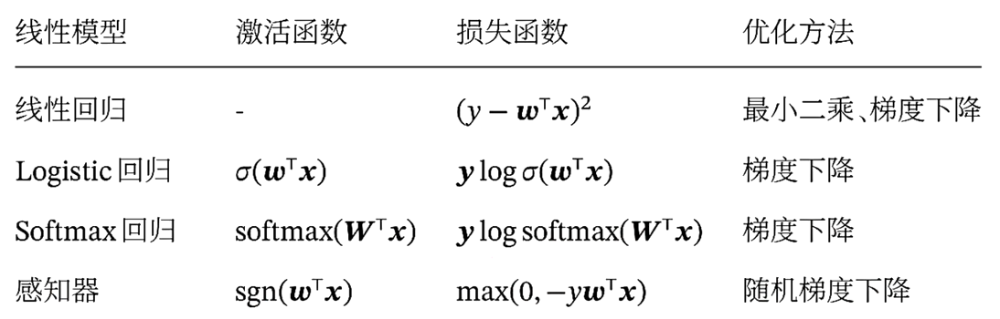

_这份笔记使用的部分图片、内容来自于北京交通大学深度学习课程，版权归课题组和原作者所有。_

## 机器学习基础概念

1. 机器学习算法分类

## 数学基础

1. 范数：一个表示向量长度的函数
   - $$l_1$$ 范数：向量的各个元素的绝对值之和

   - $$l_2$$ 范数：向量的各个元素的平方和再开平方

   - $$l_\infin$$ 范数：向量的各个元素的最大绝对值

   - 矩阵的范数

     - 常用的 $$l_p$$ 范数

       

     - 矩阵的F范数是向量的l2范数的推广

       

2. 矩阵微分：多元微积分的一种表达方式，即使用矩阵和向量来表示因变量每个成分关于
   自变量每个成分的偏导数

   - 分母布局

   

## 线性模型

深度学习除了最后一层，前面的N-1层都是在做特征变换（特征表示），只有最后一层在完成真正的任务（回归、分类）。

- 线性回归：输出的标签是连续值
- Logistic回归：二分类
- Softmax回归：多分类（三分类以上）
- 感知机

### Logistic回归

将分类决策问题看作**条件概率估计**问题

- 用线性函数组合特征：$$f=w^Tx$$
- 引入非线性函数 $$g(\cdot)$$ 来计算类别标签的条件概率 $$p(y=c|x)$$，其中 $$c \in \{ 0,1 \}$$
- 函数 $$g(\cdot)$$ 把线性函数的值域从实数区间“挤压”到了 $$(0,1)$$ 之间，可以用来表示概率

如何构造  $$g(\cdot)$$：选择Logistic函数（激活函数）

- Logistic 回归可以看作预测值为“标签的对数几率”的线性回归模型。因此
  Logistic 回归也称为对数几率回归（Logit Regression）

#### 熵（Entropy）

在信息论中，熵用来衡量一个随机事件的不确定性

- 自信息（Self Information）：$$I(x)=-\log(p(x))$$
- 熵：自信息的期望

$$
\begin{aligned}
H(X) &= \mathbb{E}_X[I(x)] \\
&= \mathbb{E}_X[-\log p(x)] \\
&= -\sum_{x \in \mathcal{X}} p(x) \log p(x)
\end{aligned}
$$

熵越高，则随机变量的信息越多；熵越低，则随机变量的信息越少

在对分布 $$p(x)$$ 的信息进行编码时，熵 $$H(p)$$ 也是理论上最优的平均编码长
度，这种编码方式称为熵编码（Entropy Encoding）

例如：单选题有ABCD选项，每个概率为0.25，则 $$p(x)=0.25$$，代入得$$H(X)=2$$，符合ABCD使用2位进行编码：00 01 10 11

#### 交叉熵（Cross Entropy）损失函数

交叉熵是按照概率分布α的最优编码对真实分布为p的信息进行编码的长度

$$
\begin{aligned}
H(p,q) &= \mathbb{E}_p[-\log q(x)] \\
&= -\sum_{x} p(x) \log q(x)
\end{aligned}
$$

- 在给定 p 的情况下，如果 q 和 p 越接近，交叉熵越小
- 如果 q 和 p 差别越大，交叉熵就越大

**逻辑回归使用交叉作为损失函数**

$$
H(p,q) = -\sum_{x} p(x) \log q(x)
$$

对于训练样本 $$(x^{(n)}, y^{(n)})$$：

$$
p_r(y^{(n)}=1|x^{(n)})=y^{(n)}, p_r(y^{(n)}=0|x^{(n)})=1-y^{(n)}
$$

真实概率和预测概率之间的交叉熵为：

$$
H(p,q) = -[p_r(y^{(n)}=1|x^{(n)})\log \hat y^{(n)}+p_r(y^{(n)}=0|x^{(n)})\log (1-\hat y^{(n)})
$$

其中 $$\hat{y}^{(n)} = \sigma(w^\top x^{(n)})$$

### Softmax 回归

Softmax Regression，也称为多项（Multinomial）或多类(Multi-Class）的Logistic 回归，是Logistic 回归在多分类问题上的推广。

Softmax 回归中，首先还是利用线性函数作特征的映射（判别函数），然后利用Softmax 函数作为非线性的决策函数

$$
\begin{aligned}
p(y=c|x)&=\mathrm{softmax}(w_c^\top x) \\
&=\frac{\exp(w_c^\top x)}{\sum_{c'=1}^C \exp(w_c^\top x)}
\end{aligned}
$$

$$
\begin{aligned}
\hat y &= \arg \max_{c=1}^C p(y=c|x) \\
&= \arg \max_{c=1}^C w_c^\top x
\end{aligned}
$$

### 感知机（Perceptron）

感知机由Frank Rosenblatt于1958年提出，是一种广泛使用的线性分类器。感知器可谓是最简单的人工神经网络，只有一个神经元。

- 一种错误驱动的在线学习算法
- 先初始化一个权重向量 $$w \leftarrow 0$$（通常是全零向量）；
- 每次分错一个样本(x,y)时，即 $$yw^\top x <0$$
- 用这个样本来更新权重 $$w \leftarrow w+yx$$
- 根据感知器的学习策略，可以反推出感知器的损失函数为

$$
\mathcal{L}({w}; {x}, y) = \max(0, -y {w}^\top {x})
$$

### 小结

- 在 Logistic 回归和 Softmax 回归中，y 为类别的 one-hot 向量表示
- 在感知器中，$$y \in \{+1,-1\}$$
