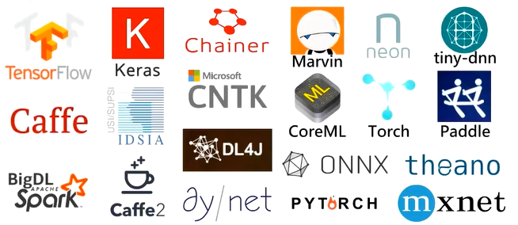
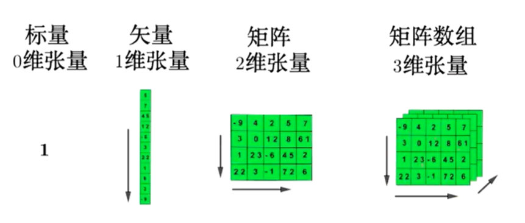
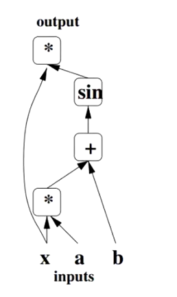
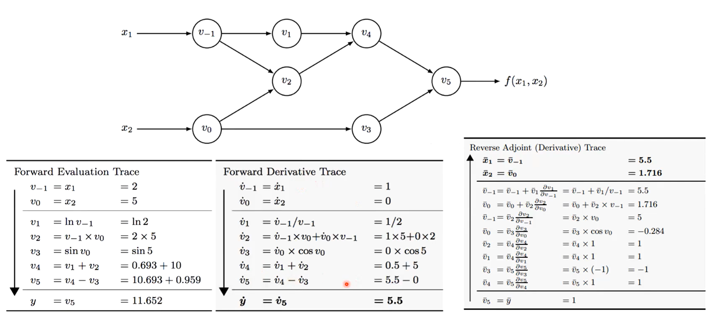
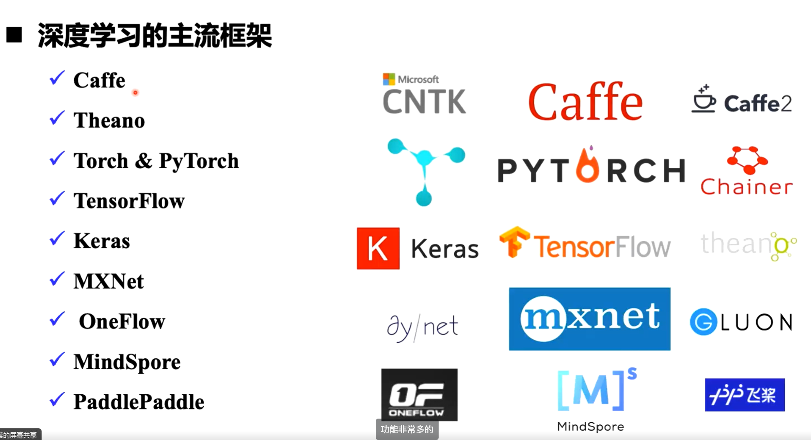
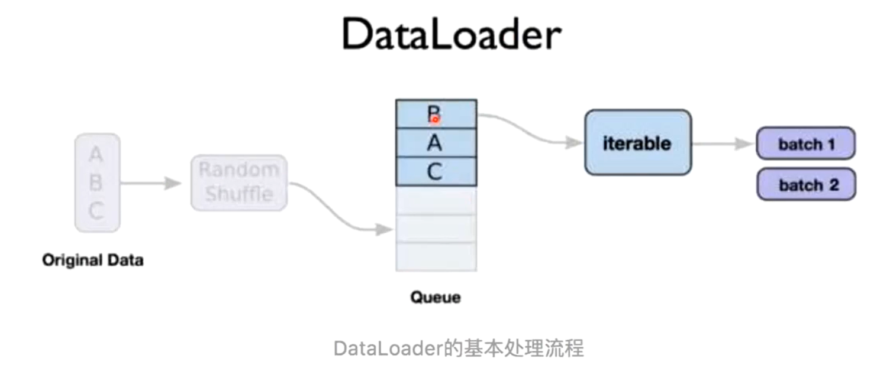

_这份笔记使用的部分图片、内容来自于北京交通大学深度学习课程，版权归课题组和原作者所有。_

## 1. 开源框架概述

图像识别任务：根据图像矩阵输入给出类别

更难的任务：对图片进行描述

**卷积神经网络（CNNs）**对这类图像分类任务十分有效

**从头开始实现一个卷积神经网络模型？**

我们可能需要几天（甚至几周）才能得到一个有效的模型，时间成本太高！

**可以利用已有的开源框架实现**

### 什么是深度学习框架

深度学习框架是一种接口、库或工具，利用预先构建和优化好的组件集合定义模型。

一个良好的深度学习框架应具备的关键特性：

- 性能优化
- 易于理解和编码
- 良好的社区支持
- 并行处理以减少计算
- **自动计算梯度**：梯度下降算法



## 2. 核心组件

深度学习框架核心组件：

- **张量**：一种用来表示深度学习数据的数据结构（多维），类似矩阵的形式
- **基于张量的操作**
- **计算图**：维护从输入到输出的数据流（操作），可以反向计算梯度
- **自动微分工具**
- **BLAS、cuBLAS、cuDNN等拓展包**：用来加速多维张量的计算

这节课掌握前四种

### 张量

张量是深度学习框架中最核心的组件，**Tensor实际上就是一个多维数组**

#### 张量属性

Tensor对象具有3个属性

- rank: number of dimensions
- shape: number of rows and columns
- type: data type of tensor's elements



#### 张量操作

类型转换：字符串转为数字、转为64（32）位浮点类型（整型）等。

数值操作：按指定类型与形状生成张量、正态（均匀）分布随机数、设置随机数种子。

形状变换：将数据的shape按照指定形状变化、插入维度、将指定维度去掉等。

数据操作：切片操作、连接操作等。

算术操作：求和、减法、取模、三角函数等。

矩阵相关的操作：返回给定对角值的对角tensor、对输入进行反转、矩阵相乘、求行列式...

### 计算图

#### 计算图结构

用不同的**占位符**（*，+，sin）构成**操作结点**，以字母x、a、b构成变量结点。

用有向线段将这些结点连接起来，组成一个表征**运算逻辑关系**的清晰明了的‘’图”型数据结构。



(Bengio Y. Learning deep architects for AI[J]. Foundations and trends in Machine Learning, 2009, 2(1): 1-127.)

### 自动微分工具

计算图带来的一个好处是让模型训练阶段的梯度计算变得模块化且更为便捷也就是自动微分法。
**自动微分 Forward Mode**：给定函数 f(x1,x2）=ln(x1）+x1x2－sin(x2)



### BLAS、cuBLAS、cuDNN等拓展包

通过前面所介绍的组件，已经可以搭建一个全功能的深度学习框架：

将待处理数据转换为张量，针对张量施加各种需要的操作，通过自动微分对模型展开训练，然后得到输出结果开始测试。

**存在的缺陷是运行缓慢**

利用扩展包来进行加速，例如：

- Fortran实现的BLAS(基础线性代数子程序)
- 英特尔的MKL (Math Kernel Library)
- NVIDIA推出的针对GPU优化的 cuBLAS 和 cuDNN 等更据针对性的库
- JAX是谷歌提出的一个包含可组合函数转换的数值计算库

## 3. 主流框架



## 4. 主流框架介绍

## 5. PyTorch 入门

PyTorch是一个基于**Python**的库，用来提供一个具有灵活性的深度学习开发平
台。PyTorch的工作流程非常接近Python的科学计算库——numpy.

PyTorch像Python一样简单，可以顺利地与Python数据科学栈集成，取代了具
有特定功能的预定义图，PyTorch为我们提供了一个框架，以便可以在运行时构
建计算图，甚至在运行时更改它们。

PyTorch的其他一些优点还包括：**多gpu支持**，**自定义数据加载器**和**简化的预处理器**。

### Tensor

Tensor，又名张量。可简单地认为它是一个数组，且支持高效的科学计算。它可以是一个数（标量）、一维数组（向量）、二维数组（矩阵）或更高维的数组（高阶数据）。Tensor和numpy的ndarrays类似，但PyTorch的tensor支持GPU加速。

- 创建tensor：可以从现有的numpy数组，list等容器创建，也可以随机生成指定形状的，还有一些特殊的(如全0，全1等)，如下定义一个简单的一维矩阵：

```python
a = torch.FloatTensor([2])
```

- 基本操作：索引，切片，连接等。
- 算术操作：加减乘除，乘方等。`c=a+b`
- 其他操作。

### 自动求导

**autograd**

torch.autograd 是为了方便用户使用，专门开发的一套自动求导引擎，它能够根据**输入**和**前向传播**过程**自动构建计算图**，并执行**反向传播**。

autograd 包就是用来自动求导的，可以为张量上的所有操作提供自动求导机制，而 **torch.Tensor** 和 **torch.Function** 为 autograd 上的两个核心类，他们相互连接并生成一个有向非循环图。

> 在创建torch.Tensor时，如果属性.require_grad为True，它将会追踪对于该张量的所有操作。
> 
> 可以通过用torch.no_grad0包裹代码块来阻止autograd去跟踪那些标记为.requesgrad=True的张量的历史记录。
> 
> 当通过调用.backward0来自动计算所有的梯度，这个张量所有梯度将会自动累加到.grad属性。
> 
> backward(函数接受参数，该参数应和调用backwardO函数的Tensor的维度相同，或者是可broadcast的维度。
> 
> 如果求导的tensor为标量（即一个数字），backward中参数可省略。
{: .prompt-tip}

### nn

**Torch.nn模块是构建于autograd之上的神经网络模块。**

#### nn.Module

torch.nn的核心数据结构是Module，它是一个抽象的概念，**既可以表示神经网络中的某个层，也可以表示一个包含很多层的神经网络**。最常见的做法就是继承nn.Module，编写自己的网络。

- 能够自动检测到自己的parameter，并将其作为学习参数。
- 主Module能够递归查找子Module中的parameter。

> 为了方便用户使用，PyTorch实现了神经网络中绝大多数的layer，这些layer都继承于nn.Module，封装了可学习参数parameter，并实现了forward函数。
> 
> 且专门针对GPU运算进行了CuDNN优化，其速度和性能都十分优异
> 
> https://pytorch.org/docs/stable/nn.html
{: .prompt-tip}

####  nn.functional
nn 中还有一个很常用的模块：nn.functional。nn 中的大多数 layer 在 functional 中都有一个与之对应的函数。

nn.functional 中的函数和 nn.Module 的主要区别：

- nn.Module 实现的 layers 是一个特殊的类，都是由 class Layer(nn.Module) 定义，会自动提取可学习的参数；
- 而 nn.functional 中的函数更像是纯函数，由 def function(input) 定义。

下面举例说明两者之间的区别。

示例代码：

```python
import torch as t
import torch.nn as nn
from torch.autograd import Variable as V
input = V(t.randn(2,3))
model = nn.Linear(3,4)
output1 = model(input)	#得到输出方式1
output2 = nn.functional.linear(input, model.weight, model.bias） # 得到输出方式2
print(output1 == output2)
```

输出结果:
```python
tensor([[True, True, True, True], [True, True, True, True]])
```

> 如果模型有可学习的参数时，最好使用nn.Module
> 
> 激活函数（ReLU、sigmoid、Tanh）、池化（MaxPool）等层没有可学习的参数可以使用对应的functional函数
> 
> 卷积、全连接等有可学习参数的网络建议使用nn.Module
> 
> dropout没有可学习参数，建议使用 nn.Dropout 而不是 **nn.functional.dropout**，方便测试集运行
{: .prompt-warning}

具体层可参照官方文档（https://pytorch.org/docs/stable/index.html），但阅读文档时应主要关注以下几点：

- 构造函数的参数，如nn.Linear(in_features，out_features，bias)，需关注这三个参数的作用。
- 属性、可学习参数和子Module。如nn.Linear中有weight和bias两个可学习参数，不包含子Module。
- 输入输出的形状，如nn.linear的输入形状是(N，input_features)，输出为(N,
  output_features), N是batch_size.

#### 实现自定义层的步骤

要实现一个自定义层大致分以下几个主要的步骤

1）自定义一个类，继承自Module类，并且一定要实现两个基本的函数

- 构造函数\_\_init\_\_
- 前向计算函数 forward 函数

2）在构造函数\_\_init\_\_中实现层的参数定义

- 例如：Linear层的权重和偏置
- Conv2d 层的 in_channels, out_channels, kernel_size, stride=1, padding=0, dilation=1, groups=1, bias=True, padding_mode=’zeros' 这—系列参数

3）在前向传播forward函数里面实现前向运算。

- 通过 torch.nn.functional 函数来实现
- 自定义自己的运算方式。如果该层含有权重，那么权重必须是 nn.Parameter 类型

4）补充：一般情况下，我们定义的参数是可以求导的，但是自定义操作如不可导，需要实现backward函数。

#### 优化器

PyTorch将深度学习中常用的优化方法全部封装在 torch.optim 中，其设计十
分灵活，能够很方便地扩展成自定义的优化方法。

所有的优化方法都是继承基类 optim.Optimizer，并实现了自己的优化步骤。最基本的优化方法是随机梯度下降法（SGD）。需要重点关注的是，优化时如何调整学习率。

PyTorch还能动态修改学习率参数，有以下两种方式：

- 修改 optimizer.param_groups 中对应的学习率。
- 新建优化器，由于 optimizer 十分轻量级，构建开销很小，故可以构建新的 optimizer

#### 随机梯度下降法(SGD)
如果我们的样本非常大，比如数百万到数亿，那么计算量异常巨大。因此，实用的算法是SGD算法。在SGD算法中，每次更新的迭代，只计算一个样本。这样对于一个具有数百万样本的训练数据，完成一次遍历就会对更新数百万次，效率大大提升。

示例代码：

```python
# 调整学习率，新建一个optimizer
old_1r=0.1
optimizer=optim.SGD([
	{'param':net.features.parameters()},
    {'param':net.classifiers.parameters(),'lr':old_lr*0.5}], lr=1e-5)
```

### 常用工具

#### 数据处理

在PyTorch中，数据加载可通过自定义的数据集对象实现。数据集对象被抽象为Dataset类，实现自定义的数据集需要继承Dataset，并实现两个Python方法。

- \_\_getitem\_\_：返回一条数据或一个样本。obj[index]等价于obj.\_\_getitem\_\_(index)。
- \_\_len\_\_：返回样本的数量。len(obj)等价于obj.\_\_len\_\_()。

Dataset 只负责数据的抽象，一次调用`__getitem__`只返回一个样本。在训练神经网络时，是对一个batch的数据进行操作，同时还需要对数据进行并行加速等。因此，PyTorch 提供了 DataLoader 帮助实现这些功能。



https://ymzhang-cs.github.io/posts/use-of-dataloader-and-dataset/

```python
class MyDataset(Dataset) :
    # Initialize your data, download, etc.
    def __init__(self): #读取csv文件中的数据
        xy = np.loadtxt('data-diabetes.csv', delimiter=',', dtype=np.float32)
        self.len = xy.shape[0] # 除去最后一列为数据位，存在x_data 中
        self.x_data = torch.from_numpy(xy[:,0:-1]） #最后一列为标签为，存在y_data中
        self.y_data = torch.from_numpy(xy[:, [-1]])
    def __getitem__(self, index): #根据索引返回数据和对应的标签
    	return self.x_data[index], self.y_data[index]
    def __len__(self): # 返回文件数据的数目
    	return self.len
```

```python
#调用自己创建的Dataset
dataset = Mydataset()
train_loader = DataLoader(dataset=dataset, batch_size=32, shuffle=True, num_workers=2)

#循环来迭代来高效地获取数据
for i, data in enumerate(train_loader, 0):
    # get the inputs
    inputs, labels = data
    # wrap them in Variable
    inputs, labels = Variable(inputs), Variable(labels)
    # Run your training process
    print(step, i, "inputs", inputs.data, "labels", labels.data)
```

#### 计算机视觉工具包：torchvision

视觉工具包 torchvision 独立于PyTorch，需要通过 `pip install torchvision` 安装。torchvision 主要包含以下三个部分：

- models：提供深度学习中各种经典网络的网络结构及预训练好的模型，包括 Net、VGG 系
  列、ResNet 系列、Inception 系列等。
- datasets：提供常用的数据集加载，设计上都是继承 torch.utils.data.Dataset，主要包括
  MNIST、CIFAR10/100、ImageNet、COCO 等。
- transforms：提供常用的数据预处理操作，主要包括对 Tensor 以及 PIL Image 对象的操作。

##### torchvision.models

torchvision.models 这个包中包含 alexnet、densenet、inception、resnet、squeezenet、vgg 等常用的网络结构，并且提供了预训练模型，可以通过简单调用来读取网络结构和预训练模型。

代码示例：

```python
# 导入了resnet50的预训练模型
import torchvision
model = torchvision.models.resnet50(pretrained=True)

# 如果只需要网络结构，不需要用预训练模型的参数来初始化，那么就是：
model = torchvision.models.resnet50(pretrained=False)
```

##### torchvision.datasets

torchvision.datasets这个包中包含 MNIST、FakeData、COCO、LSUN、ImageFolder、DatasetFolder、ImageNet、CIFAR 等一些常用的数据集，并且提供了数据集设置的一些重要参
数设置，可以通过简单数据集设置来进行数据集的调用。

数据集的接口基本上很相近。它们至少包括两个公共的参数 transform 和 target_transform，以便
分别对输入和目标做变换。所有数据集的子类 torch.utils.data.Dataset 采用\_\_getitem\_\_和\_\_len\_\_方法来实现。

代码示例：

```python
imagenet_data = torchvision.datasets.ImageNet('path/to/imagenet_root/')
data_loader = torch.utils.data.DataLoader(imagenet_data,
                                          batch_size=4,
                                          shuffle=True,
                                          num_workers=args.nThreads)
```

以MNIST数据集为例:

```python
torchvision.datasets.MNIST(root, train = True, transform = None,
				target_transform = None, download = False)
```

**参数介绍：**

root (string) - 数据集的根目录在哪里 MNIST/processed/training.pt 和 MNIST/processed/test.pt 存在

train (bool, optional)－ 如果为True，则创建数据集training.pt，否则创建数据集test.pt。

download (bool, optional) - 如果为true，则从 lnternet 下载数据集并将其放在根目录中。如果已下载数据集，则不会再次下载

transform (callable, optional) - 一个函数/转换，它接收PIL图像并返回转换后的版本。例如， transforms.RandomCrop

target_transform (callable, optional) - 接收目标并对其进行转换的函数/转换

#### 使用GPU加速

在PyTorch中以下数据结构分为CPU和GPU两个版本。

- Tensor
- nn.Module（包括常用的layer、loss function，以及容器sequential等）

它们都带有一个 `.cuda` 方法，调用此方法即可将其转化为对应的GPU对象。如果服务器具有多个GPU，`tensor.cuda()` 方法会将 tensor 保存到第一块GPU上，等价于 `tensor.cuda(0)`。此时如果想使用第二块GPU，需要手动指定 `tensor.cuda(1)`，而这需要修改大量代码很繁琐。这里有两种替代方式：

**1. 调用 t.cuda.set_device(1) 指定使用第二块GPU**

后续的 `.cuda()` 都无需更改，切换GPU只需修改这一行代码。

**2. 设置环境变量 CUDA_VISIBLE_DEVICES**

```bash
export CUDA_VISIBLE_DEVICE=1 #（下标是从0开始，1代表第二块GPU)
```

CUDA_VISIBLE_DEVICES 还可以指定多个GPU，如：

```bash
export CUDA_VISIBLE_DEVICES=0,2,3
```

#### 保存和加载

在PyTorch中，需要将Tensor、Variable等对象保存到硬盘，以便后续能通过相应的方法加载到
内存中。

- 这些信息最终都是保存成 Tensor。
- 使用 `t.save` 和 `t.load` 即可完成 Tensor 保存和加载的功能。
- 在 save/load 时可指定使用的 pickle 模块，在 load 时还可以将 GPU tensor 映射到 CPU 或其他
  GPU上.
- 使用方式：
  `t.save(obj,file_name)`：保存任意可序列化的对象。
  `obj = t.load(file_name)`：方法加载保存的数据。
