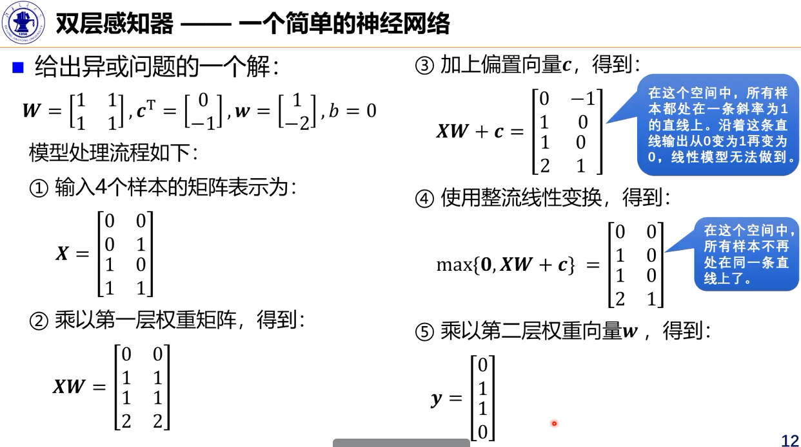
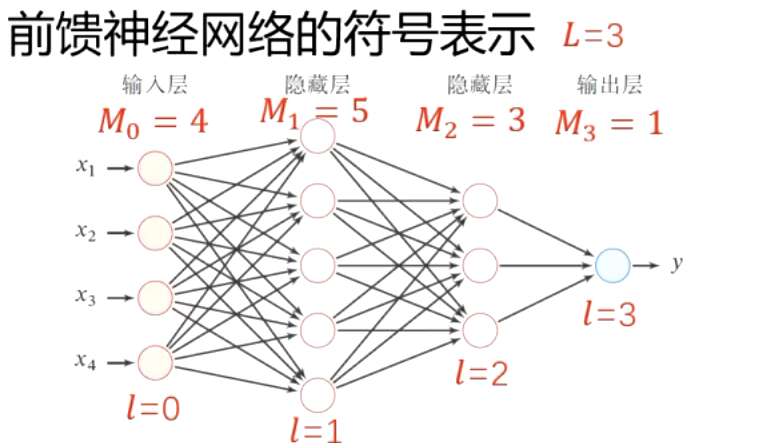
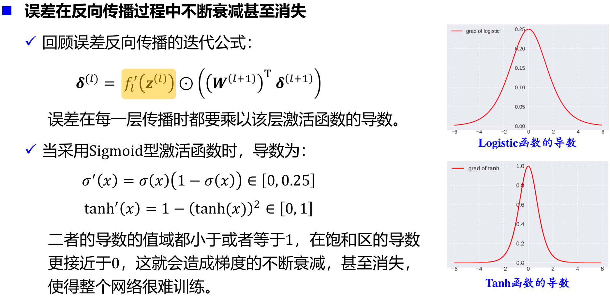

_这份笔记使用的部分图片、内容来自于北京交通大学深度学习课程，版权归课题组和原作者所有。_

## 感知器求解异、或、非、异或问题

相关文献证明：对于两分类问题，如果训练集是线性可分的那么感知器算法可以在有限次送代后收敛：如果训练集不是线性可分的，那么感知器算法则不能确保会收敛！

## 神经网络结构

### 1. 万能近似定理

根据通用近似定理，对于具有**线性输出层**和至少一个使用“挤压”性质的激活函数的**隐藏层**组成的神经网络，只要其隐藏层神经元的数量足够多，它就可以以任意精度来近似任何一个定义在实数空间中的有界闭集函数。

**神经网络可以作为一个“万能”函数来使用，用来进行复杂的特征转换或逼近一个复杂的条件分布。**

### 2. 为什么要深度？

**单隐层网络可以近似任何函数，但其规模可能巨大**

在最坏的情况下，需要指数级的隐藏单元才能近似某个函数[Barron，1993]

**随着深度的增加网络的表示能力呈指数增加**

具有d个输入、深度为l、每个隐藏层具有n个单元的深度整流网络可以描述的线性区域的数量为
$$
O((_d^n)^{d(l-1)}n^d)
$$
意味着，网络描述能力为深度的**指数级**[Montufar et al,2014]。

Which means:

**更深层的网络具有更好的泛化能力**

**参数数量的增加未必一定会带来模型效果的提升**

### 3. 常见的神经网络结构

#### 前馈网络

- 各个神经元按照接收信息的先后分成不同的组，每一组可看作一个神经层。
- 每一层中的神经元接收来自前一层神经元的输出，并并输出给下一层神经元
- 整个网络中信息**朝一个方向传播**，没有反向的信息传播，可以用一个有向无环图表示
- 前馈网络包括**全连接前馈神经网络**和**卷积神经网络**

#### 记忆网络
- 也称为反馈网络神经元
- 不但可以接收其他神经元的信息，也可以接收自己的**历史信息**
- 神经元具有**记忆功能**，在不同的时刻具有不同的状态
- 信息传播可以是**单向或者双向传递**，可用一个有向循环图或无向图来表示
- 记忆网络包括**循环神经网络、Hopfield网络、玻尔兹曼机、受限玻尔兹曼机**等

#### 图网络

- 图网络是定义在图结构数据居上的神经网络
- 图中的每个节点都是由一个或者一组神经元构成
- 节点之间的连接可以是有向的，也可以是无向的
- 每个节点可以接收来自相邻节点或者自身的信息
- 图网络是前馈网络和记忆网络的泛化，包含许多不同的实现方式，如图卷积网络、图注意力网络、消息传递网络等

## 前馈神经网络

### 前馈神经网络结构和表示

前馈神经网络(Feedforward Neural Network，FNN)是最早发明的简单人工神经网络

前馈神经网络也经常被称为多层感知器(Multi-Layer Perceptron，MLP)，但这个叫法并不十分合理（激活函数通常并不是感知器所采用的不连续阶跃函数）

第0层为输入层，最后一层为输出层，其他中间层称为隐藏层

信号从输入层向输出层单向传播，整个网络中无反馈，可用一个有向无环图表示

#### 符号表示

| 记号                                                     | 含义                                 |
| -------------------------------------------------------- | ------------------------------------ |
| $$ L $$                                                    | 神经网络的层数                       |
| $$ M_l $$                                                  | 第 $$ l $$ 层神经元的个数              |
| $$ f_l(\cdot) $$                                           | 第 $$ l $$ 层神经元的激活函数          |
| $$ \mathbf{W}^{(l)} \in \mathbb{R}^{M_l \times M_{l-1}} $$ | 第 $$ l-1 $$ 层到第 $$ l $$ 层的权重矩阵 |
| $$ \mathbf{b}^{(l)} \in \mathbb{R}^{M_l} $$                | 第 $$ l-1 $$ 层到第 $$ l $$ 层的偏置     |
| $$ \mathbf{z}^{(l)} \in \mathbb{R}^{M_l} $$                | 第 $$ l $$ 层神经元的净输入 (净活性值) |
| $$ \mathbf{a}^{(l)} \in \mathbb{R}^{M_l} $$                | 第 $$ l $$ 层神经元的输出 (活性值)     |

令 $$a^{(0)} = x$$，信息通过以下公式不断迭代传播：

$$
z^{(l)} = W^{(l)} a^{(l-1)} + b^{(l)}
$$

$$
a^{(l)} = f_{l}(z^{(l)})
$$

以上公式也可合并写成：

$$
z^{(l)} = W^{(l)} f_{l-1}(z^{(l-1)}) + b^{(l)}
$$

或者：

$$
a^{(l)} = f_{l}(W^{(l)} a^{(l-1)} + b^{(l)})
$$

如此，通过逐层传递，得到最后的输出 $$a^{(L)}$$，整个网络可以看做一个复合函数 $$\phi(x; W, b)$$：

$$
a^{(0)} \rightarrow z^{(1)} \rightarrow a^{(1)} \rightarrow z^{(2)} \rightarrow \dots \rightarrow a^{(L-1)} \rightarrow z^{(L)} \rightarrow a^{(L)}
$$

$$
\parallel
$$

$$
x \quad \longrightarrow \quad \phi(x; W, b)
$$

### 隐藏单元——激活函数

隐藏单元（激活函数）的设计是一个非常活跃的研究领域，，但是目前还没有很明确的指导原则

**性质要求**

- **连续并可导**（允许少数点上不可导）的**非线性**函数。可导的激活函数可以直接利用数值优化的方法来学习网络参数。
- **激活函数及其导函数要尽可能的简单**，有利于提高网络计算效率。
- 激活函数的**导函数的值域要在一个合适的区间内**，不能太大也不能太小，否则会影响训练的效率和稳定性。

#### Sigmoid型函数

Sigmoid型函数指一类S型曲线函数，为**两端饱和函数（两端的导数为0）**

##### Logistic函数

$$
\sigma (x) = \frac{1}{1+\exp(-x)}
$$

- 具有“挤压"”功能
- 输出可看作概率分布（和为1）

##### Tanh函数

$$
\tanh(x)=\frac{\exp(x)-\exp(-x)}{\exp(x)+\exp(-x)}=2\sigma(2x)-1
$$

- 零中心化，可提升收敛速度

##### Hard-Logistic函数

$$
\mathrm{hard-logistic}(x)=\max(\min(0.25x+0.5, 1), 0)
$$

##### Hard-Tanh函数

$$
\mathrm{hard-tanh}(x)=\max(\min(x, 1), -1)
$$

这两个函数是对Logistic和Tanh函数的分段近似。

**与Logistic和Tanh函数相比，降低了计算开销。**

#### 整流线性单元（ReLU）函数及其扩展

##### ReLU

$$
\mathrm{ReLU}(x) = 
\begin{cases} 
x, & \text{if } x \geq 0 \\ 
0, & \text{if } x < 0 
\end{cases}
= \max(0, x)
$$

- 是目前最常用的激活函数
- 具有**单侧抑制（负半区域消失）、宽兴奋边界**的生物学合理性
- 可缓解梯度消失问题
- **稀疏性激活**
- 缺点：有可能导致神经元的死亡

##### 带泄露的ReLU（Leaky ReLU）

$$
\mathrm{LeakyReLU}(x)=
\begin{cases}
x, x \geq 0 \\
\gamma x, x < 0
\end{cases}
= \max(0,x) + \gamma \min(0,x)
$$

- 在$$x<0$$时也保持一个很小的梯度，避免永远不能被激活的情况
- $$\gamma$$为超参

##### 指数线性单元ELU

##### Softplus

##### Swish函数

##### 高斯误差线性单元（GELU）

#### Maxout单元

Maxout是一种分段线性函数

- ReLU等激活函数的输入是神经元的净输入𝑧(标量)
- Maxout 单元的输入是向量𝒙 （向量）
- 每个Maxout 单元有𝐾个权重向量和偏置
- Maxout单元不单是净输入到输出之间的非线性映射，而是整体学习输入到输出之间的非线性映射关系
- Maxout可以看做任意凸函数的分段线性近似

### 输出单元

神经网络前N-1层在做特征变换，最后一个输出层要告诉用户最终的结果。

#### 线性输出单元

$$
\hat y = w^Th+b
$$

- 线性输出单元经常用于产生条件高斯分布的均值
- 适合**连续值预测（回归）问题**
- 基于高斯分布，最大化似然（最小化负对数似然）等价于最小化均方误差，因此线性输出单元可采用均方误差损失函数：

其中$$y^{(n)}$$为真实值，$$\hat y^{(n)}$$为预测值，$$N$$为样本数。

#### Sigmoid单元

- Sigmoid输出单元常用于输出Bernoulli分布
- 适合**二分类问题**
- Sigmoid输出单元可采用交叉熵损失函数：

#### Softmax单元

- Softmax输出单元常用于输出Multinoulli分布(categorical distribution)
- 适合**多分类问题**
- Softmax输出单元可采用交叉熵损失函数：

### 参数学习过程

#### 学习准则

> **正则化项的作用**
> 
> 正则化的主要作用是防止过拟合，对模型添加正则化项可以限制模型的复杂度，使得模型在复杂度和性能达到平衡。
{: .prompt-tip}

#### 梯度下降

## 反向传播算法

给定一个样本$$(x,y)$$，假设神经网络输出为$$\hat y$$，损失函数为$$L(y, \hat y)$$，采用梯度下降法需要计算损失函数关于每个参数的偏导数。

如何高效计算前馈神经网络中参数的偏导数 —— 反向传播(Back Propagation，BP)算法
BP is a beautifully local process. It is a way of computing gradients of expressions through recursive application of chain rule.

## 自动梯度计算

## 神经网络参数优化的主要问题

1. 神经网络的优化问题是一个非凸优化问题

2. 误差在反向传播过程中不断衰减甚至消失

