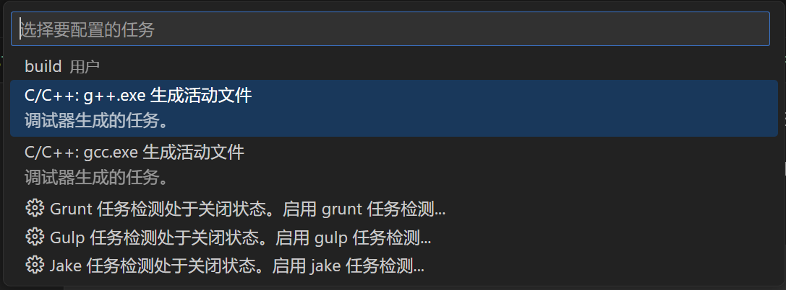

众所周知，Visual Studio Code 配置 C/C++ 编译环境比较繁琐，如果对 tasks.json 等文件格式不熟悉，很容易找不到正确的配置方法。

下面提供一种通用且优雅的解决方案，使用 MSYS 2 进行 MinGW 环境管理，不需编写 JSON 即可快速完成 Visual Studio Code 的 tasks.json 编译配置。

## 1. 安装 MSYS 2

MSYS 2 提供了一个构建环境，允许用户使用 `pacman` 命令在 Windows 系统下对 GCC、MinGW 等环境进行管理。

> **MSYS2** 是工具和库的集合，为您提供了一个易于使用的环境来构建、安装和运行本机 Windows 软件。
> 
> 它由一个名为的命令行终端组成 mintty、bash、git 和 subversion 等版本控制系统、tar 和 awk 等工具，甚至 autotools 等构建系统，所有这些都基于 Cygwin 的修改版本。尽管其中一些核心部分基于 Cygwin，但 MSYS2 的主要重点是为本机 Windows 软件提供构建环境，并且使用 Cygwin 的部分保持在最低限度。 MSYS2 为 GCC、mingw-w64、CPython、CMake、Meson、OpenSSL、FFmpeg、Rust、Ruby 等提供最新的本机构建。
> 
> Source: https://www.msys2.org/

根据教程安装 MSYS 2，并安装 MinGW64：[Windows 下 MSYS2 环境配置和 MinGW-w64 C++ 环境配置](https://blog.51cto.com/u_15127622/2882605)

## 2. 添加 MinGW64 环境变量

首先需要找到 MinGW64 的 bin 目录。默认路径为：`C:\msys64\mingw64\bin`，复制备用。

如果你在安装时修改了 MSYS 2 的安装路径，你需要打开 MSYS 2 的安装目录，找到安装路径下的 `mingw64\bin` 目录，复制路径。

在 Windows 搜索框中输入“环境变量”，打开“编辑系统环境变量”，点击右下角“环境变量”，在下方的“系统环境变量”列表里找到 Path 并双击该行，点击“新建”，粘贴刚刚保存的 bin 目录路径。

如果你不知道如何调整 Path 的顺序，就让这条路径待在最下面吧。

## 3. 设置 IntelliSense 配置

>VS Code 的 IntelliSense 提供了代码补全功能。一般会自动识别编译器路径，但**建议检查一下是否正确**。
>
>如果 IntelliSense 使用的是 Visual Studio 的 MSVC，可能导致 `bits/stdc++.h` 等头文件无法使用的问题。

由于 VS Code 对各个语言的 IntelliSense 支持是基于插件的，所以首先需要安装 C/C++ 拓展。

安装完成后，点击 <kbd>Ctrl</kbd>+<kbd>Shift</kbd>+<kbd>P</kbd>，输入 `C/C++`，找到 `C/C++：编辑配置（UI）`，选中回车。

在弹出的配置页面中调整下面选项：

- **编译器路径**：选择为刚才配置的环境变量路径下的 `g++.exe`，默认为 `C:/msys64/mingw64/bin/g++.exe`，如果下拉框没有则手动输入
- **IntelliSense 模式**：调整为 `windows-gcc-x64`
- **C 标准 / C++ 标准**：按需调整

完成即可使用该环境进行语法检查和提示。

## 4. 配置 tasks.json 添加编译和调试配置

> 这一步可以偷懒：只需要安装 CodeRunner 插件，就不用进行 tasks 配置了。

二选一：
1. 点击 <kbd>Ctrl</kbd>+<kbd>Shift</kbd>+<kbd>P</kbd>，输入 `tasks`，找到 `任务：配置任务` / `Tasks: Configure Task`，选中回车。
2. 点击 <kbd>Ctrl</kbd>+<kbd>Shift</kbd>+<kbd>B</kbd>，选择 `配置生成任务` / `Configure Build Task`。

由于已经安装了 C/C++ 插件，所以你应该可以直接选择系统推荐的 `C/C++: g++.exe 生成活动文件`，选择路径正确的编译器回车即可。

这时，工作目录下的 `.vscode` 目录会自动生成 `tasks.json` 文件。

任意打开一个 C/C++ 文件，就可以开心运行啦~

## 参考

https://code.visualstudio.com/docs/languages/cpp
