## 计算机视觉任务

### 数据集

1. IMAGENET：数据量较大
2. CIFAR-10：数据量较小

数据集扩充：旋转、遮蔽

### 机器学习常规套路

1. 收集数据，给定标签
2. 训练分类器
3. 测试，评估

### K-近邻算法（KNN）

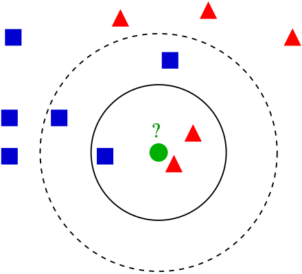

k近邻算法，也称为KNN 或k-NN，是**一种非参数、有监督的学习分类器，KNN 使用邻近度对单个数据点的分组进行分类或预测**。 虽然k近邻算法(KNN) 可以用于回归或分类问题，但它通常用作分类算法，假设可以在彼此附近找到相似点。 对于分类问题，**根据多数票分配类别标签**，也就是使用在给定数据点周围最常表示的标签。

#### 计算过程

1. 计算已知类别数据集中的点与当前点的距离
2. 按照距离依次排序
3. 选取与当前点距离最小的 K 个点
4. 确定前 K 个点所在类别的出现概率
5. 返回前 K 个点出现频率最高的类别作为当前点预测分类

#### 在图像处理中的局限性

背景主导是最大的问题，我们关注的是主体。

## 神经网络（NN）：前向传播

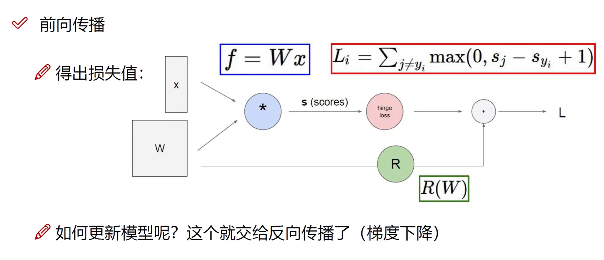

### 整体概述

神经网络是一种模拟人脑神经元网络的计算模型，广泛应用于机器学习和深度学习领域。下面将从神经网络的基本结构和各个组件的功能出发，顺序讲解其运算过程。

#### 1. 输入层 (Input Layer)

输入层是神经网络的起点，用于接收输入数据。每个节点（神经元）代表输入数据的一个特征。比如在图像识别中，输入层的节点可能对应于图像的每个像素值。

#### 2. 隐藏层 (Hidden Layers)

隐藏层位于输入层和输出层之间，可以有一个或**多个**。隐藏层的节点数可以自行设定，这些节点通过连接权重与前一层和后一层的节点相连。

**计算过程**

##### a. 得分函数 (Score Function)

在隐藏层和输出层中，每个节点都会计算其“得分”，即该节点的激活值。得分函数通常是加权求和再加上偏置项。具体来说，对于第 $$j$$ 个隐藏层节点，其得分计算公式为：
$$
z_j = \sum_{i=1}^{n} w_{ji} x_i + b_j
$$
其中，$$w_{ji}$$ 是权重，$$ x_i $$ 是前一层第 $$i$$ 个节点的输出，$$ b_j $$ 是偏置项。

##### b. 激活函数 (Activation Function)

得分函数的输出会通过激活函数进行非线性变换，激活函数帮助模型捕捉非线性关系。常见的激活函数有：
- **Sigmoid**: \$$ \sigma(z) = \frac{1}{1 + e^{-z}} $$
- **ReLU (Rectified Linear Unit)**: \$$ \text{ReLU}(z) = \max(0, z) $$
- **Tanh**: \$$ \tanh(z) = \frac{e^z - e^{-z}}{e^z + e^{-z}} $$

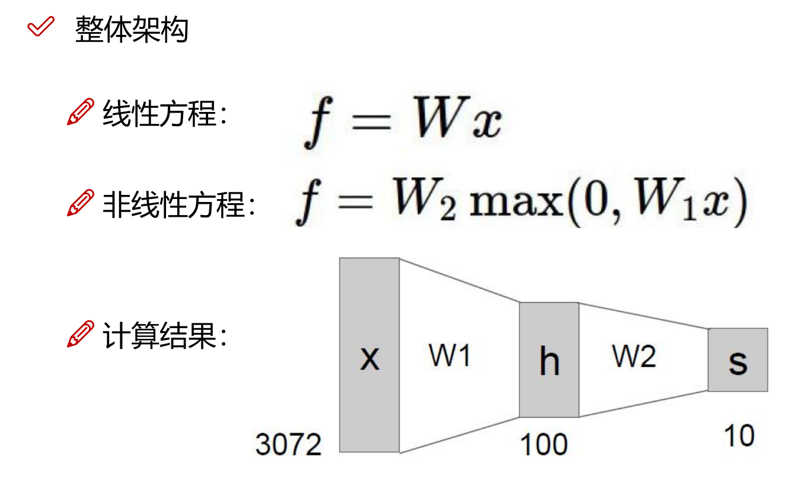

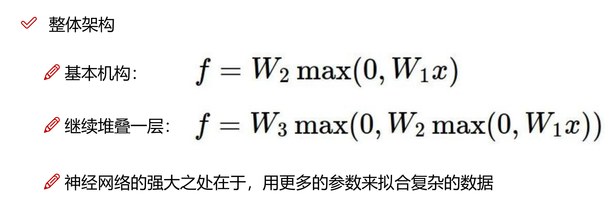

#### 3. 输出层 (Output Layer)

输出层是神经网络的最后一层，其节点数和任务相关。对于分类任务，输出层的节点数通常等于类别数，每个节点代表一个类别的概率。对于回归任务，输出层通常只有一个节点，输出预测值。

#### 4. 损失函数 (Loss Function)

损失函数用于衡量模型预测值与实际值之间的差距，常见的损失函数有：

- **均方误差 (MSE, Mean Squared Error)**：用于回归任务，公式为：
  \$$
  \text{MSE} = \frac{1}{n} \sum_{i=1}^{n} (y_i - \hat{y}_i)^2
  $$
  其中，\$$ y_i $$ 是实际值，\$$ \hat{y}_i $$ 是预测值。

- **交叉熵损失 (Cross-Entropy Loss)**：用于分类任务，公式为：
  \$$
  \text{Cross-Entropy} = -\sum_{i=1}^{n} y_i \log(\hat{y}_i)
  $$
  其中，\$$ y_i $$ 是实际类别的指示函数，\$$ \hat{y}_i $$ 是预测的概率值。

#### 5. 反向传播 (Backpropagation)

为了减少损失函数值，神经网络会进行反向传播，调整权重和偏置项。反向传播利用梯度下降算法，通过计算损失函数相对于每个权重的梯度，逐层更新权重：
$$
w_{ji} \leftarrow w_{ji} - \eta \frac{\partial \text{Loss}}{\partial w_{ji}}
$$
其中，$$ \eta $$ 是学习率。

#### 6. 迭代训练

上述过程会在训练数据上进行多次迭代，每次迭代（称为一个 epoch）都会更新网络参数，使模型逐渐收敛到一个较优的解，从而提升预测性能。

总结起来，神经网络通过输入层接收数据，隐藏层进行复杂特征提取和变换，输出层生成最终预测结果，损失函数衡量预测误差，反向传播更新权重，从而实现模型的训练和优化。

#### 7. 神经元个数的影响

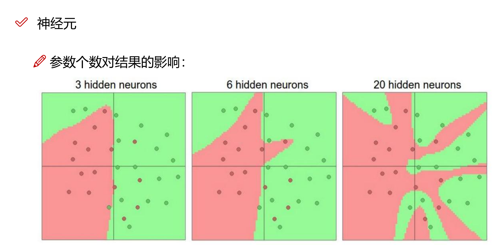

#### 8. 权重参数矩阵初始化

参数初始化同样非常重要！
通常我们都使用随机策略来进行参数初始化

```python
W = 0.01 * np.random.randn(D, H)
```

#### 9. dropout

> The term “dropout” refers to dropping out the nodes (input and hidden layer) in a neural network (as seen in Figure 1). All the forward and backwards connections with a dropped node are temporarily removed, thus creating a new network architecture out of the parent network. The nodes are dropped by a dropout probability of p.
> 术语“dropout”是指丢弃神经网络中的节点（输入层和隐藏层）（如图 1 所示）。与被删除节点的所有前向和后向连接都被暂时删除，从而在父网络之外创建一个新的网络架构。节点以 p 的丢弃概率被丢弃。

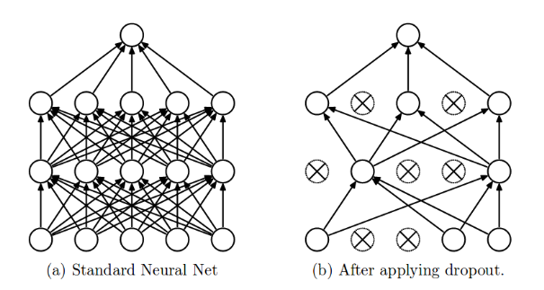

Dropouts can be used with most types of neural networks. It is a great tool to reduce overfitting in a model. It is far better than the available regularisation methods and can also be combined with max-norm normalisation which provides a significant boost over just using dropout.
Dropout 可用于大多数类型的神经网络。它是减少模型过度拟合的好工具。它比可用的正则化方法要好得多，并且还可以与最大范数归一化相结合，这比仅使用 dropout 提供了显着的提升。

**Ref:** https://towardsdatascience.com/dropout-in-neural-networks-47a162d621d9

### 线性函数（得分函数）

从输入到输出的映射。

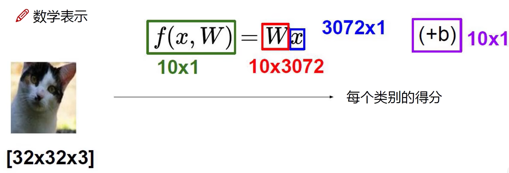

$$ x $$: image，行数代表特征数量	$$ W $$: parameter，每行代表一个类别，列与 $$ x $$ 相同	$$ b $$: 偏置，微调对象

函数结果为 $$ 10 \times 1 $$ 矩阵，每个元素代表一个类别的得分。

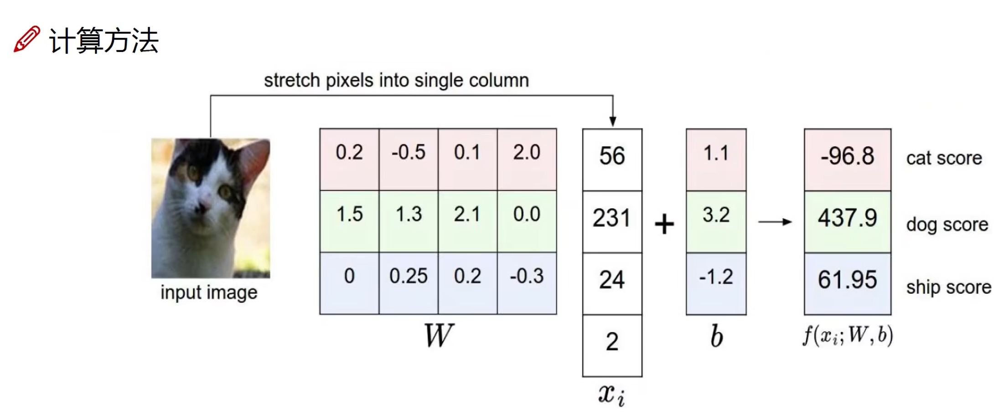

一般情况下，会存在不止一个隐藏层，从而 $$ x $$ 会经过不止一个得分函数的 $$ W $$。但并**不是线性变换**，因为隐藏层包含了得分函数和激活函数，得分函数是线性变换，而激活函数有可能是非线性的。

### 激活函数

人工神经网络中节点的激活函数是一种**根据节点的各个输入及其权重计算节点输出的函数**。如果激活函数是非线性的，则可以仅使用少数节点解决非平凡的问题。

激励函数一般用于神经网络的层与层之间，上一层的输出通过激励函数的转换之后输入到下一层中。神经网络模型是非线性的，如果没有使用激励函数，那么每一层实际上都相当于矩阵相乘。经过非线性的激励函数作用，使得神经网络有了更多的表现力。

#### Sigmoid

$$
\sigma (x)={\frac {1}{1+e^{-x}}}={\frac {e^{x}}{1+e^{x}}}=1-\sigma (-x)
$$


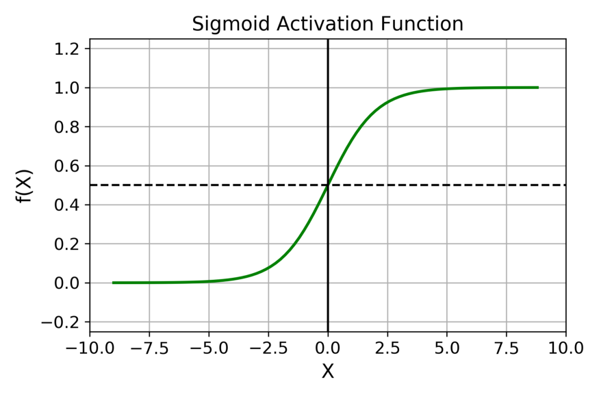

在什么情况下适合使用 Sigmoid 激活函数呢？

- Sigmoid 函数的输出范围是 0 到 1。由于输出值限定在 0 到 1，因此它对每个神经元的输出进行了**归一化**；
- 用于**将预测概率作为输出**的模型。由于概率的取值范围是 0 到 1，因此 Sigmoid 函数非常合适；
- **梯度平滑**，避免「跳跃」的输出值；
- 函数是**可微**的。这意味着可以找到任意两个点的 sigmoid 曲线的斜率；
- 明确的预测，即非常接近 1 或 0。

Sigmoid 激活函数有哪些缺点？

- **==梯度消失==**；
- 函数输出不是以 0 为中心的，这会**降低权重更新的效率**；
- Sigmoid 函数执行指数运算，计算机**运行得较慢**。

#### ReLU


#### Softmax

$$
\sigma ( z )_{i}={\frac {e^{z_{i}}}{\sum _{j=1}^{K}e^{z_{j}}}}\,
$$

Softmax 函数可以将上一层的原始数据进行归一化，转化为一个【0,1】之间的数值，这些数值可以被当做概率分布，用来作为多分类的目标预测值。Softmax 函数一般作为神经网络的最后一层，接受来自上一层网络的输入值，然后将其转化为概率。**之所以要选用 $$ e $$ 作为底数的指数函数来转换概率，是因为上一层的输出有正有负，采用指数函数可以将其第一步都变成大于0的值，然后再算概率分布**。得到的概率值加和为1.

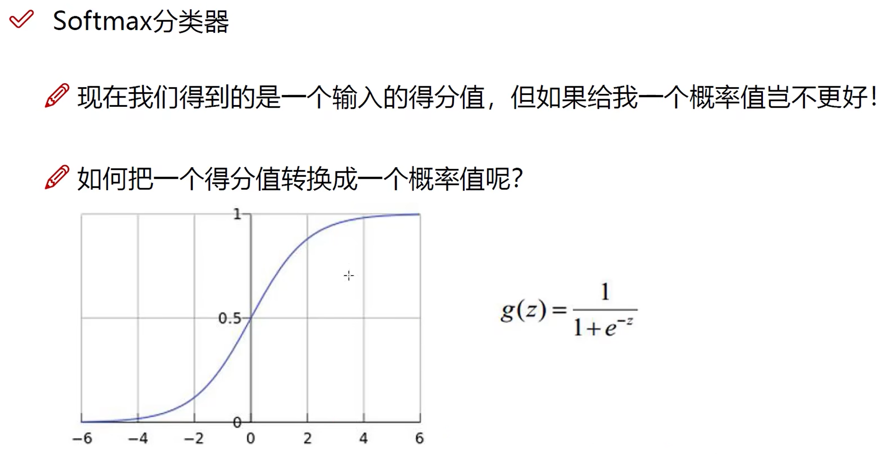

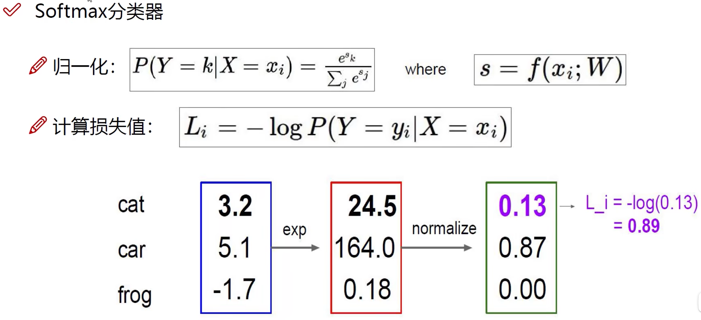


#### 对比

**Sigmoid 函数**：使数据规整在 0 - 1 之间，适用于==多分类问题==。

- Linear Regression 的输出使用 Sigmoid 激活后成为 Logistic Regression，而 Logistic Regression 能实现非线性特征变换。
- 类似的激活函数还有 **ReLU**，**tanh**（双曲正切）函数等。
- Sigmoid 产生的概率是独立的，并且不限于总和为 1。这是因为 sigmoid 分别查看每个原始输出值。


**Softmax 函数**：使所有值总和为 1，并保持大小关系，适用于==多标签分类问题==。

- 与 Linear Regression  不同，Softmax Regression 的输出单元从一个变成了多个，且引入了 softmax 运算使输出更适合离散值的预测和训练。
- Softmax 的输出都是相互关联的。根据设计，softmax 产生的概率总和始终为 1。因此，如果我们使用 softmax，为了增加一类的概率，至少其他一类的概率必须减少等量的量。


**Ref** [Sigmoid 与 Softmax 对比](https://glassboxmedicine.com/2019/05/26/classification-sigmoid-vs-softmax/)

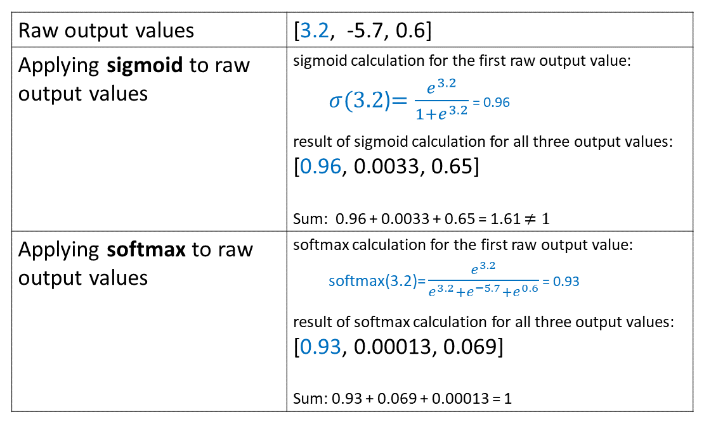

**==Summary 概括==**

- If your model’s output classes are NOT mutually exclusive and you can  choose many of them at the same time, use a sigmoid function on the  network’s raw outputs.
  如果模型的输出类不是互斥的，并且您可以同时选择其中许多类，请对网络的原始输出使用 sigmoid 函数。
- If your model’s output classes are mutually exclusive and you can only  choose one, then use a softmax function on the network’s raw outputs.
  如果模型的输出类是互斥的，并且您只能选择一个，则对网络的原始输出使用 softmax 函数。


### 损失函数

损失函数（loss function）或代价函数（cost function）是**将随机事件或其有关随机变量的取值映射为非负实数以表示该随机事件的“风险”或“损失”的函数**。 在应用中，损失函数通常作为学习准则与优化问题相联系，即通过最小化损失函数求解和评估模型。

At its core, a loss function is incredibly simple: It’s a method of evaluating how well your [algorithm](https://www.datarobot.com/wiki/algorithm/) models your dataset. If your predictions are totally off, your loss  function will output a higher number. If they’re pretty good, it’ll  output a lower number. As you change pieces of your algorithm to try and improve your model, your loss function will tell you if you’re getting  anywhere.
从本质上讲，损失函数非常简单：它是一种评估算法对数据集建模效果的方法。**如果您的预测完全错误，您的损失函数将输出更高的数字。如果它们相当好，它会输出一个较低的数字。**当您更改算法的各个部分以尝试改进模型时，损失函数会告诉您是否取得了进展。
Ref: [Introduce to Loss Function](https://www.datarobot.com/blog/introduction-to-loss-functions/)

损失函数有很多种，下面是一些例子。

#### Hinge Loss

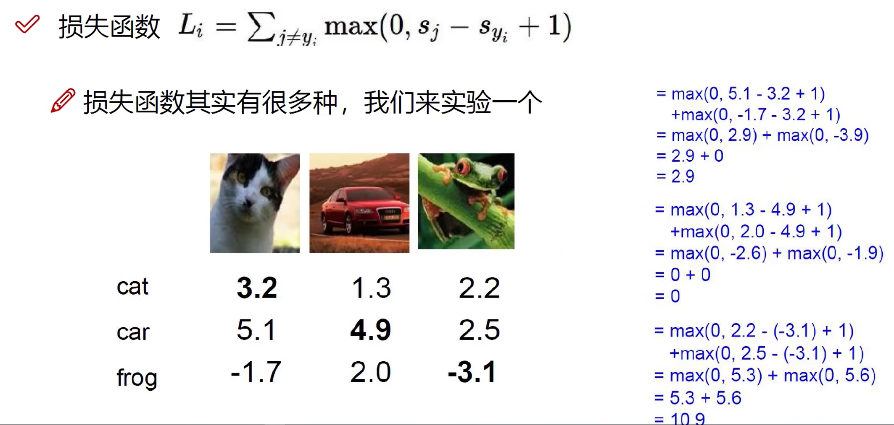

这里的 1 代表我希望这份数据对正确类别的预测值比第二大的值至少多 1.

### 正则化：损失函数的改进

正则化（regularization）是机器学习中**用于防止模型过拟合（overfitting）的一种技术**。 正则化的主要目的是限制模型的复杂度，以减少过拟合的风险，即模型在训练数据上表现得很好，但在新的、未见过的数据上表现不佳的现象。 通过在损失函数中添加一个正则项，可以缩小解空间，从而减少求出过拟合解的可能性。

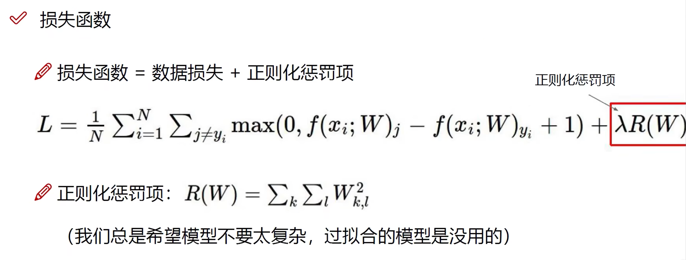

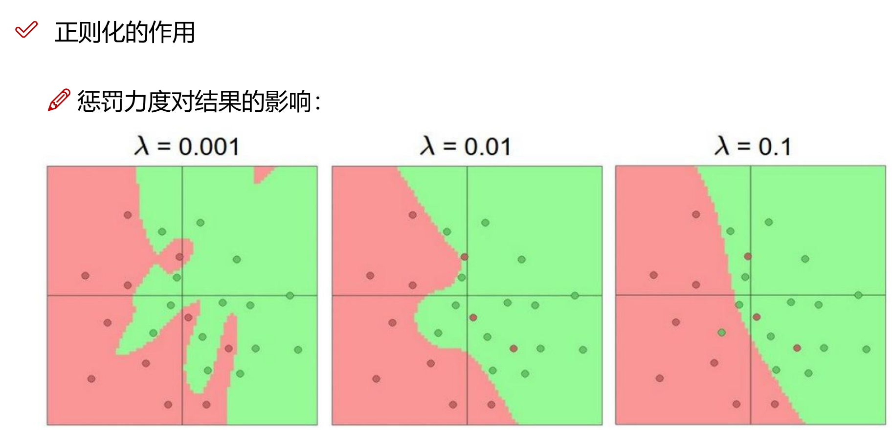


## 神经网络（NN）：反向传播

**反向传播**（英语：Backpropagation，缩写为BP）是“误差反向传播”的简称，是一种与最优化方法（如**梯度下降法**）结合使用的，用来训练人工神经网络的常见方法。该方法计算对网络中所有权重计算损失函数的梯度。这个梯度会反馈给最优化方法，用来更新权值以最小化损失函数。 在神经网络上执行梯度下降法的主要算法。该算法会先按前向传播方式计算（并缓存）每个节点的输出值，然后再按反向传播遍历图的方式计算损失函数值相对于每个参数的偏导数。

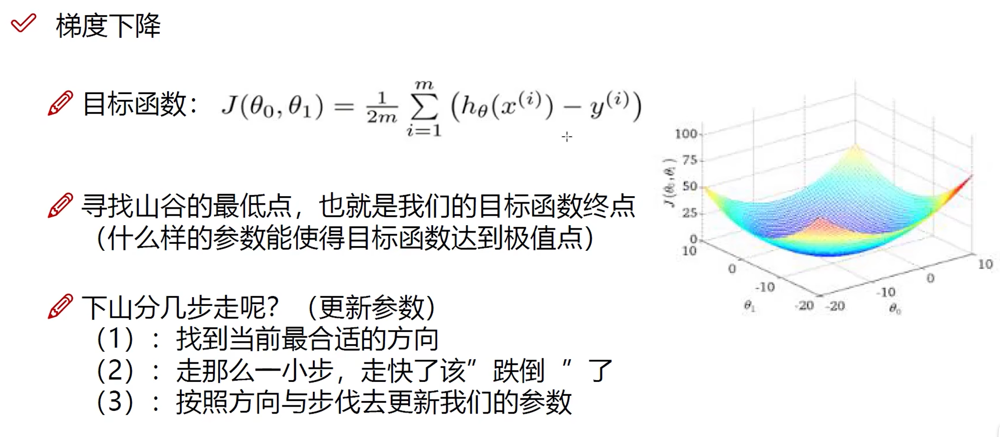

### 门单元

#### sigmoid 门单元

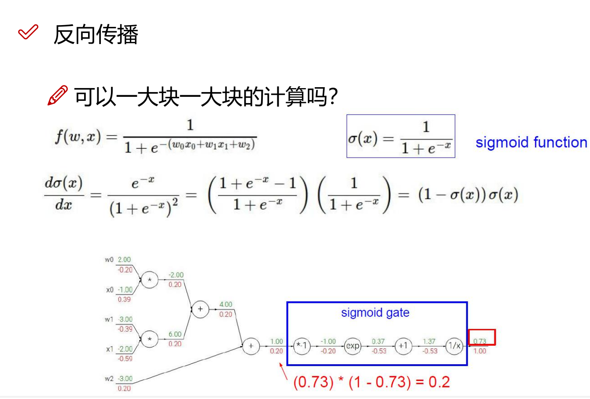

#### 加法门单元

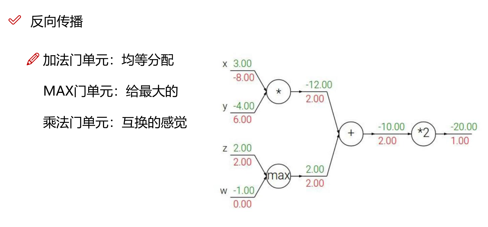

#### MAX 门单元

#### 乘法门单元

## 数据预处理

### 标准化

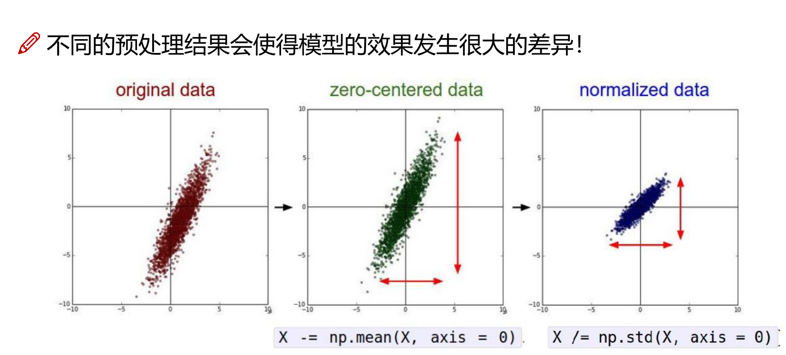

## 卷积神经网络（CNN）

### 理解卷积神经网络

#### CNN 是什么

**Ref:** [卷积神经网络](https://zh.d2l.ai/chapter_convolutional-neural-networks/index.html)

> 在前面的章节中，我们遇到过图像数据。 这种数据的每个样本都由一个二维像素网格组成， 每个像素可能是一个或者多个数值，取决于是黑白还是彩色图像。 到目前为止，我们处理这类结构丰富的数据的方式还不够有效。 我们仅仅通过将图像数据展平成一维向量而忽略了每个图像的空间结构信息，再将数据送入一个全连接的多层感知机中。 因为这些网络特征元素的顺序是不变的，因此最优的结果是利用先验知识，即利用相近像素之间的相互关联性，从图像数据中学习得到有效的模型。
>
> 本章介绍的*卷积神经网络*（convolutional neural network，CNN）是一类强大的、为处理图像数据而设计的神经网络。 基于卷积神经网络架构的模型在计算机视觉领域中已经占主导地位，当今几乎所有的图像识别、目标检测或语义分割相关的学术竞赛和商业应用都以这种方法为基础。
>
> 现代卷积神经网络的设计得益于生物学、群论和一系列的补充实验。 卷积神经网络需要的参数少于全连接架构的网络，而且卷积也很容易用GPU并行计算。 因此卷积神经网络除了能够高效地采样从而获得精确的模型，还能够高效地计算。 久而久之，从业人员越来越多地使用卷积神经网络。即使在通常使用循环神经网络的一维序列结构任务上（例如音频、文本和时间序列分析），卷积神经网络也越来越受欢迎。 通过对卷积神经网络一些巧妙的调整，也使它们在图结构数据和推荐系统中发挥作用。

#### CNN 能够实现的任务

- 检测任务

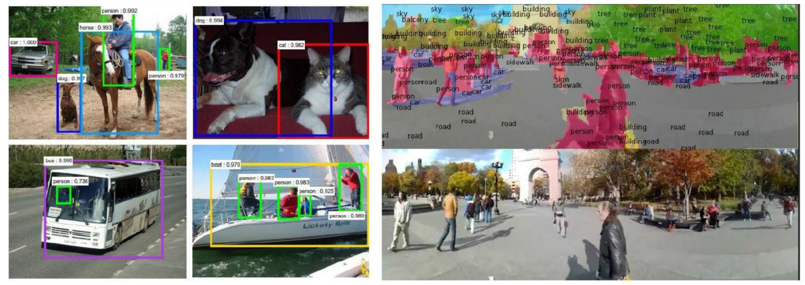

- 分类与检索

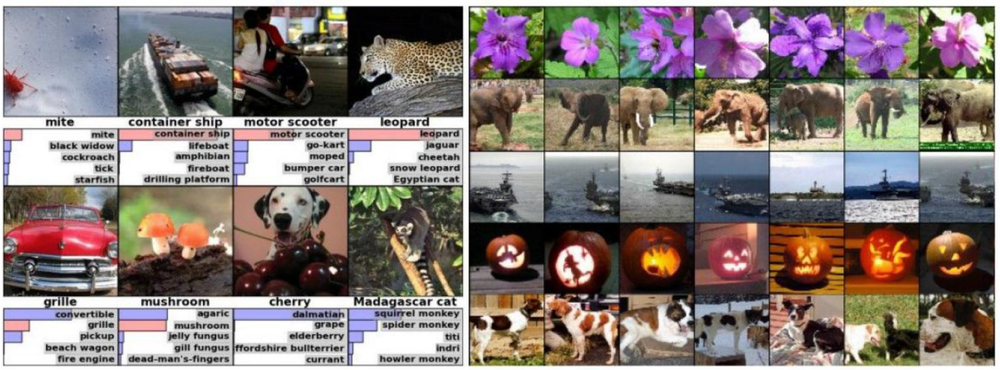

- 超分辨率重构


- 医学任务等

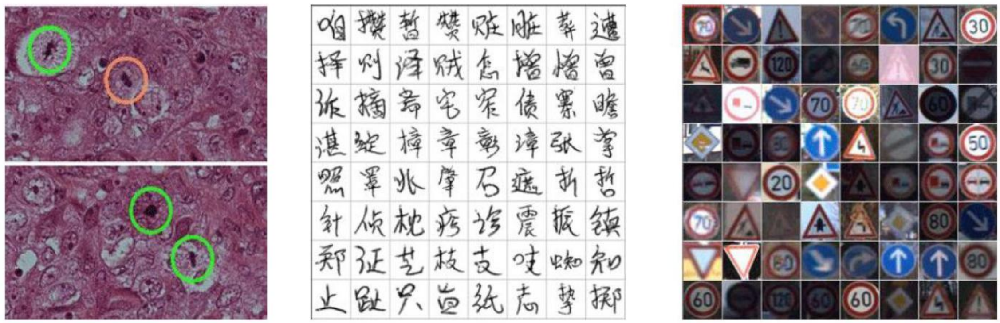

- 自然语言处理（NLP）

卷积神经网络也常被用于[自然语言处理](https://zh.wikipedia.org/wiki/自然语言处理)。 CNN的模型被证明可以有效的处理各种自然语言处理的问题，如语义分析[[8\]](https://zh.wikipedia.org/zh-cn/卷积神经网络#cite_note-8)、搜索结果提取[[9\]](https://zh.wikipedia.org/zh-cn/卷积神经网络#cite_note-9)、句子建模[[10\]](https://zh.wikipedia.org/zh-cn/卷积神经网络#cite_note-10) 、分类[[11\]](https://zh.wikipedia.org/zh-cn/卷积神经网络#cite_note-11)、预测[[12\]](https://zh.wikipedia.org/zh-cn/卷积神经网络#cite_note-12)、和其他传统的NLP任务[[13\]](https://zh.wikipedia.org/zh-cn/卷积神经网络#cite_note-13) 等。

#### CNN 与传统网络的区别

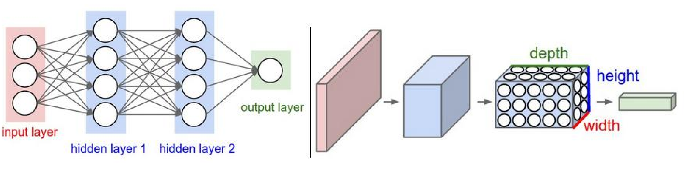

**Left: Traditional NN. Right: CNN.**

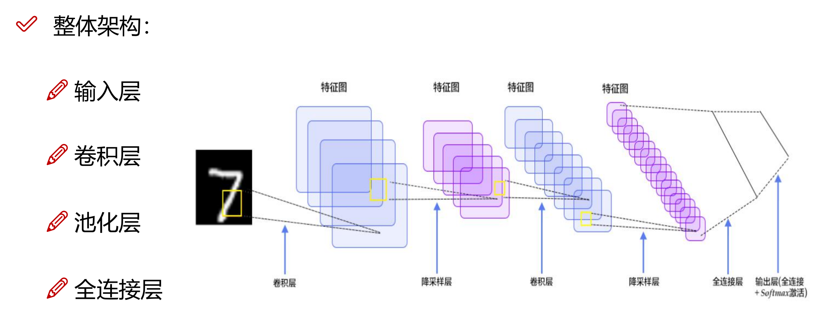

#### 什么是卷积

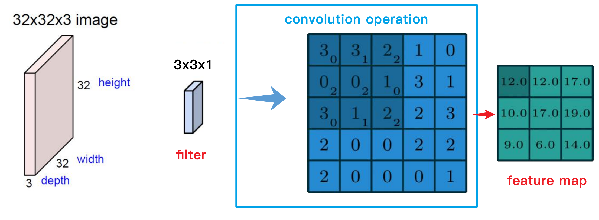

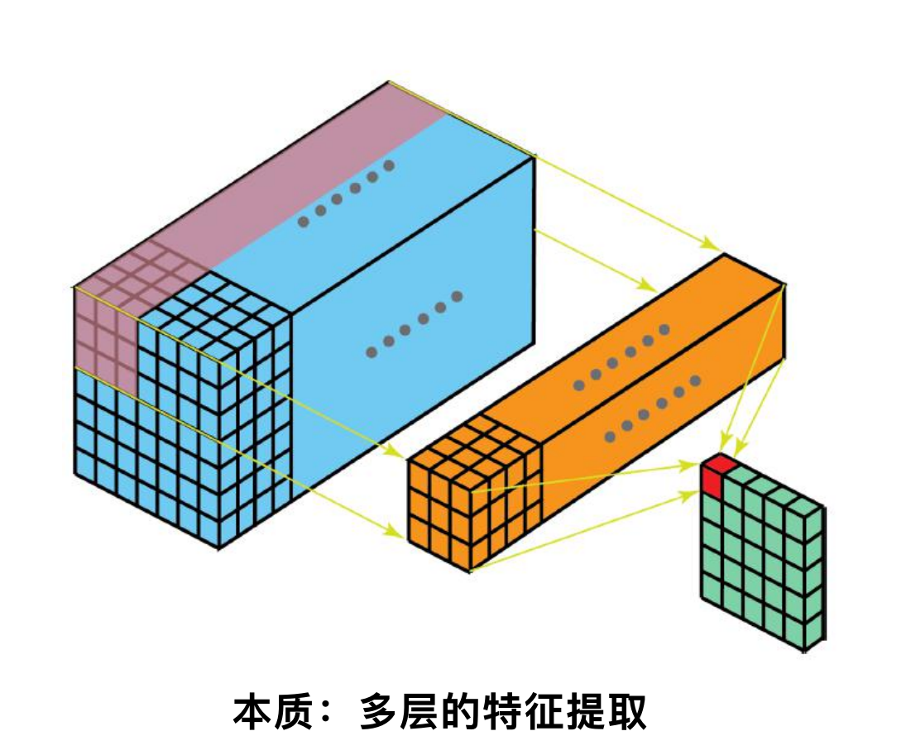

#### 什么是卷积核（滤波器、权重矩阵）

卷积核（Convolutional Kernel）是卷积神经网络（Convolutional Neural Network, CNN）中用于提取输入数据特征的关键组件。卷积核通常被称为滤波器（Filter）或权重矩阵（Weight Matrix），它是一个小的矩阵，包含了一组可训练的参数，通过在输入数据上滑动并进行卷积操作，生成特征图（Feature Map）。

##### 定义

1. **卷积核的结构**：
   - 卷积核通常是一个小的矩阵，比如 \(\$$3 \times 3$$\), \(\$$5 \times 5$$\) 或者 \(\$$7 \times 7$$\) 等。对于彩色图像，卷积核的深度与输入图像的通道数相同（例如，对于RGB图像，深度为\$$3$$）。
   - 例如，一个 \(\$$3 \times 3$$\) 的卷积核在RGB图像上的形状是 \(\$$3 \times 3 \times 3$$\)。

2. **卷积操作**：
   - 卷积核在输入数据上滑动（也称为卷积），在每个位置上与输入数据的对应区域进行逐元素相乘，然后求和，得到一个单一值，这个过程称为点积（Dot Product）。
   - 通过在整个输入数据上重复这个过程，卷积核生成一个特征图。

##### 作用

1. **特征提取**：
   - 卷积核通过在输入数据上滑动和卷积操作，提取局部特征（如边缘、纹理等）。不同的卷积核可以提取不同的特征。

2. **参数共享**：
   - 卷积核在整个输入数据上共享同一组参数，减少了模型的参数数量，相对于全连接层更高效。

3. **空间不变性**：
   - 由于卷积核在整个输入数据上滑动，CNN能够对输入数据中的特征进行位置不变性处理，即即使特征在图像中位置变化，卷积核仍然可以检测到。

##### 特性：参数共享（Parameter Sharing）

在卷积层中，参数共享指的是每个卷积核（或滤波器）在整个输入图像中使用相同的一组权重参数进行卷积操作。也就是说，**同一个卷积核在图像的不同区域滑动时，其权重保持不变**。

参数共享的主要作用有：

1. **减少参数数量**：
   - 在全连接层中，每个输入节点与每个输出节点都有独立的连接权重，因此参数数量非常庞大。而在卷积层中，由于参数共享，每个卷积核的参数数量与图像的尺寸无关，仅取决于卷积核的大小，从而大幅度减少了参数数量。
2. **提高计算效率**：
   - 减少的参数数量使得卷积层的计算更为高效，降低了存储和计算的需求。
3. **提高泛化能力**：
   - 由于参数共享，卷积核能够捕捉到输入图像的局部特征，这些特征在图像的不同位置具有相似性，从而提高了模型的泛化能力。

> [!TIP]
>
> 假设输入图像是一个 \($$5 \times 5$$\) 的灰度图像（单通道），卷积核是一个 \($$3 \times 3$$\) 的矩阵。以下是一个具体的卷积操作例子：
>
> 输入图像：
> 
> $$
> \begin{bmatrix}
> 1 & 2 & 3 & 0 & 1 \\
> 0 & 1 & 2 & 1 & 2 \\
> 3 & 1 & 0 & 2 & 1 \\
> 1 & 2 & 1 & 0 & 0 \\
> 0 & 1 & 2 & 1 & 2 \\
> \end{bmatrix}
> $$
> 
> 卷积核：
> 
> $$
> \begin{bmatrix}
> 1 & 0 & -1 \\
> 1 & 0 & -1 \\
> 1 & 0 & -1 \\
> \end{bmatrix}
> $$
> 
> 在进行卷积操作时，卷积核从输入图像的左上角开始，逐个位置滑动，每次计算点积并生成一个输出值：
>
> 第一步（左上角部分）：
> 
> $$
> \begin{bmatrix}
> 1 & 2 & 3 \\
> 0 & 1 & 2 \\
> 3 & 1 & 0 \\
> \end{bmatrix}
> \cdot
> \begin{bmatrix}
> 1 & 0 & -1 \\
> 1 & 0 & -1 \\
> 1 & 0 & -1 \\
> \end{bmatrix}
> = (1*1 + 2*0 + 3*(-1)) + (0*1 + 1*0 + 2*(-1)) + (3*1 + 1*0 + 0*(-1))
> = 1 - 3 + 0 - 2 + 3
> = -1
> $$
> 
> 通过在输入图像上重复这个过程，可以生成一个输出特征图。

##### 区分卷积核的个数与深度

> [!CAUTION]
>
> 卷积核的数目和输入数据的层数不一定相同。这里需要区分的是卷积核的**数目**和卷积核的**深度**。卷积核的数目是指一个卷积层中使用的不同卷积核的数量，而卷积核的深度是指每个卷积核在处理输入数据时所涉及的通道数。

在卷积神经网络中，卷积核的数目和输入数据的层数（通道数）不是相同的概念：

- **卷积核的数目**：决定输出特征图的数量，是可以自行设定的超参数。
- **卷积核的深度**：必须与输入数据的通道数一致，以确保每个卷积核可以在输入数据的所有通道上进行卷积操作。

通过这种设计，卷积神经网络能够灵活地处理不同层次和数量的特征，使得模型能够更好地捕捉和表示输入数据的复杂模式和特征。

#### 什么是特征图

卷积神经网络（Convolutional Neural Network, CNN）是一种用于处理具有网格结构的数据（如图像）的深度学习模型。特征图（Feature Map）是 CNN 中的一个关键概念，用于表示卷积操作后的结果。理解卷积神经网络和特征图的关系可以帮助我们更好地理解 CNN 的工作原理。

**特征图在卷积神经网络中的作用**

1. **特征提取**：
   - 每一层卷积层生成的特征图表示输入数据在不同层级上的特征。浅层卷积层的特征图通常表示低级特征（如边缘、纹理），而深层卷积层的特征图则表示更高级的特征（如物体的部分或整体结构）。

2. **信息传递**：
   - 特征图在网络中逐层传递，每一层特征图作为下一层的输入。通过多层卷积和池化操作，CNN能够逐步提取输入数据的高层次特征，最终用于分类或其他任务。

3. **可视化和理解**：
   - 特征图的可视化可以帮助理解CNN是如何工作的。例如，可以通过可视化不同层的特征图来观察网络在各层提取到的特征，进而分析模型的性能和优化方向。

卷积神经网络通过一系列卷积层、激活函数和池化层的操作，逐步提取输入数据的特征，并生成特征图。**特征图是卷积操作后的结果，包含了输入数据中被滤波器检测到的特征**。通过多层特征图的传递和处理，CNN能够从原始输入数据中提取出有用的特征，并完成各种任务如图像分类、目标检测等。特征图在CNN中起到了信息传递和特征表示的重要作用，是理解和设计卷积神经网络的核心概念之一。

> [!NOTE]
>
> 如果在卷积层中使用多个滤波器（filters），每个滤波器会生成一个特征图。因此，一个卷积层会产生多个特征图，这些特征图堆叠在一起形成该层的输出。

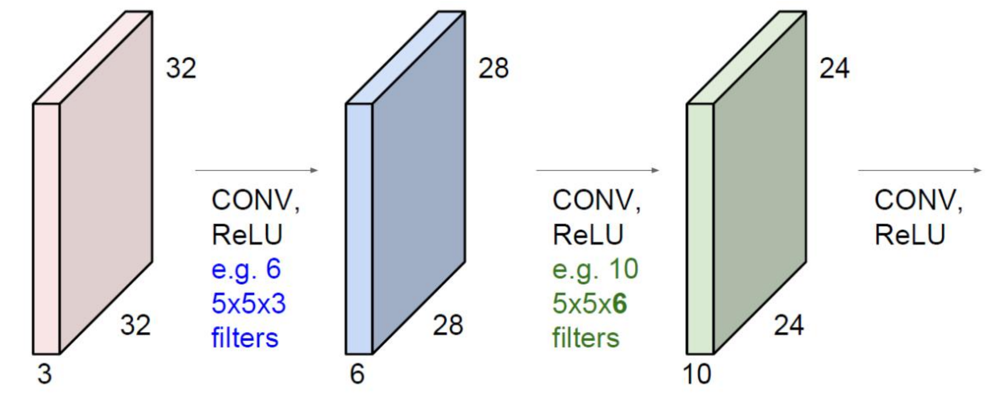

### CNN 整体网络架构

卷积神经网络（CNN）是一种专为处理图像和视频等高维数据而设计的神经网络架构。CNN 的整体网络架构通常由以下几个主要层次组成：输入层、卷积层、池化层、激活层、全连接层和输出层。下面是对 CNN 典型架构的详细解释：

#### 1. 输入层（Input Layer）

- **作用**：接收原始图像数据作为输入。
- **输入数据**：图像的像素值，通常是一个三维数组（高度、宽度和深度/通道数）。

#### 2. 卷积层（Convolutional Layer）

- **作用**：提取输入图像的局部特征，如边缘、纹理等。
- **操作**：对输入图像应用多个卷积核（滤波器），生成多个特征图。
- **参数**：卷积核大小、步长、填充和卷积核数量。
- **输出**：经过卷积操作后的特征图。

#### 3. 激活层（Activation Layer）

- **作用**：引入非线性，使得模型能够学习到更复杂的特征。
- **常见激活函数**：ReLU（Rectified Linear Unit）、Sigmoid、Tanh 等。
- **输出**：对卷积层输出的特征图应用激活函数后的结果。

#### 4. 池化层（Pooling Layer）

- **作用**：减少特征图的空间尺寸，降低参数数量和计算量，控制过拟合。
- **操作**：对特征图进行下采样操作，如最大池化或平均池化。
- **参数**：池化窗口大小、步长。
- **输出**：经过池化操作后的特征图。

#### 5. 全连接层（Fully Connected Layer）

- **作用**：将前面提取到的特征用于分类任务。
- **操作**：将池化层的输出展平为一维向量，并与全连接层的权重矩阵进行矩阵乘法。
- **输出**：用于分类或回归任务的输出向量。

#### 6. 输出层（Output Layer）

- **作用**：给出最终的分类或回归结果。
- **操作**：对全连接层的输出应用适当的激活函数（如 Softmax 用于分类，Sigmoid 用于二分类，线性激活用于回归）。
- **输出**：最终的预测结果。

### 卷积层

#### 卷积层参数

> [!IMPORTANT]
>
> - **滑动窗口步长**：影响特征图的尺寸和计算成本。较大的步长减少特征图尺寸，较小的步长保留更多细节。
> - **卷积核尺寸**：决定每次卷积操作的覆盖区域。较小的卷积核捕捉细节，较大的卷积核捕捉全局特征。
> - **边缘填充**：控制特征图尺寸和边缘信息的处理。填充可以使特征图尺寸与输入相同或更接近。
> - **卷积核个数**：决定输出特征图的深度。更多的卷积核提取更多样化的特征，提高模型的表示能力。

##### 1. 滑动窗口步长（Stride)

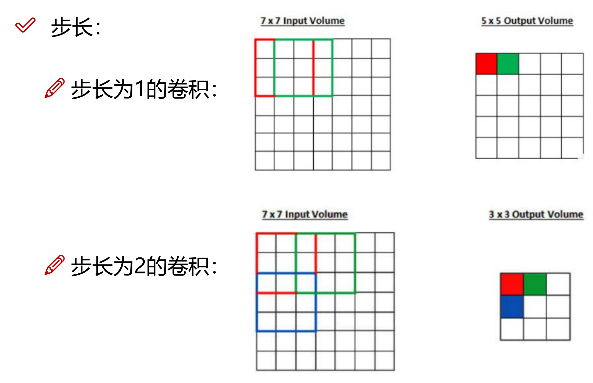

步长是卷积核在输入数据上滑动时每次移动的像素数。步长可以是水平和垂直方向上的不同值，通常为一个标量（如 1, 2 等）或一个元组（如 (2, 2) 表示在两个方向上都移动 2 个像素）。

> [!TIP]
>
> - 如果输入图像的尺寸为 \$$ 32 \times 32 $$，卷积核尺寸为 \$$ 3 \times 3 $$，没有填充且步长为 \$$ 1 $$，则输出特征图的尺寸为 \$$ 30 \times 30 $$
> - 若步长为 \$$ 2 $$，则输出特征图的尺寸为 \$$ 15 \times 15 $$。

**作用**

- 步长决定了特征图的尺寸。较大的步长会使特征图尺寸减小，较小的步长会使特征图尺寸增大。

- 步长还影响计算成本和特征的细粒度。较小的步长可以捕获更多的细节，但计算量更大；较大的步长计算量小，但可能丢失一些细节。

##### 2. 卷积核尺寸（Kernel Size）

卷积核的尺寸是一个表示卷积核高度和宽度的标量或元组（如 $$ 3 \times 3 $$, $$ 5 \times 5 $$ 等），深度省略是因为卷积核的深度必须与输入数据的层数（即通道数）相同。

> [!TIP]
>
> 一个 $$ 3 \times 3 $$ 的卷积核在输入图像上进行卷积操作时，每次覆盖 $$3$$ 行 $$3$$ 列的像素区域。

**作用**

- 卷积核的尺寸决定了每次卷积操作覆盖的输入区域大小。较大的卷积核能够捕捉更大的局部特征，但计算量也更大。

- 不同的卷积核尺寸适用于不同类型的特征提取需求。例如，较小的卷积核（如 $$ 3 \times 3$$ ）常用于捕捉细节特征，而较大的卷积核（如 $$ 7 \times 7 $$）则用于捕捉更全局的特征。

##### 3. 边缘填充（Padding）

填充是在输入数据的边缘添加额外的像素。常见的填充方式有 "valid"（无填充）和 "same"（填充使得输出特征图尺寸与输入相同）。

> [!TIP]
>
> 对于 $$ 3 \times 3 $$ 的卷积核，输入图像尺寸为 $$ 32 \times 32 $$，若使用 "same" 填充（填充 1 像素），则输出特征图尺寸仍为 $$ 32 \times 32 $$。

**作用**

- 填充可以控制特征图的尺寸。如果没有填充，卷积操作会减少特征图的尺寸。通过适当的填充，可以保持特征图的尺寸或控制其减小的程度。

- 填充还可以使卷积操作==更好地处理边缘信息==，而不是仅仅关注中心区域。

##### 4. 卷积核个数（Number of Filters）

卷积核个数是指卷积层中使用的滤波器数量。每个滤波器生成一个特征图。

> [!TIP]
>
> 如果卷积层有 64 个 $$ 3 \times 3 $$ 的卷积核，输入图像尺寸为 $$ 32 \times 32 \times 3 $$，则输出特征图的尺寸为 $$ 32 \times 32 \times 64 $$（假设步长为 $$1$$，填充为 "same"）。

**作用**

- 滤波器数量决定了输出特征图的深度（通道数）。更多的滤波器可以提取更多样化的特征，使模型具有更强的表示能力。

- 增加滤波器数量会提高模型的复杂度和计算量，但也可能提高模型的性能。

#### 卷积结果尺寸计算公式

卷积神经网络中卷积操作后特征图的尺寸可以通过以下公式计算。假设输入图像的尺寸为 \($$ H \times W \times D $$\)（高度、宽度、深度），卷积核的尺寸为 \($$ K_H \times K_W $$\)，步长为 \($$ S_H $$\)（垂直方向）和 \($$ S_W $$\)（水平方向），填充为 \($$ P_H $$\)（垂直方向）和 \($$ P_W $$\)（水平方向），输出特征图的深度为 \($$ N $$\)（卷积核个数），则输出特征图的高度和宽度可以通过以下公式计算：

**输出高度（Height）**

$$
H_{out} = \left\lfloor \frac{H - K_H + 2P_H}{S_H} \right\rfloor + 1
$$

**输出宽度（Width）**

$$
W_{out} = \left\lfloor \frac{W - K_W + 2P_W}{S_W} \right\rfloor + 1
$$

**输出深度（Depth）**

输出特征图的深度等于卷积核的数量，即 \($$ N $$\)。

**公式中的符号解释**

- \( \$$H$$ \)：输入图像的高度。
- \( \$$W$$ \)：输入图像的宽度。
- \( \$$D$$ \)：输入图像的深度（通道数）。
- \( \$$K_H$$ \)：卷积核的高度。
- \( \$$K_W$$ \)：卷积核的宽度。
- \( \$$S_H$$ \)：垂直方向的步长。
- \( \$$S_W$$ \)：水平方向的步长。
- \( \$$P_H$$ \)：垂直方向的填充大小。
- \( \$$P_W$$ \)：水平方向的填充大小。
- \( \$$N$$ \)：卷积核的数量（即输出特征图的深度）。
- \( \$$\left\lfloor x \right\rfloor$$ \)：表示对 \(x\) 进行下取整操作。

> ### 例子
>
> 假设输入图像尺寸为 \($$32 \times 32 \times 3$$\)（RGB图像），卷积核尺寸为 \($$5 \times 5$$\)，步长为 $$1$$，填充为 $$0$$，卷积核数量为 $$10$$。我们来计算卷积操作后输出特征图的尺寸。
>
> 1. **计算输出高度**：
> 
> $$
>   H_{out} = \left\lfloor \frac{32 - 5 + 2 \times 0}{1} \right\rfloor + 1 = \left\lfloor \frac{27}{1} \right\rfloor + 1 = 28
> $$
>   
>
> 2. **计算输出宽度**：
> 
> $$
>   W_{out} = \left\lfloor \frac{32 - 5 + 2 \times 0}{1} \right\rfloor + 1 = \left\lfloor \frac{27}{1} \right\rfloor + 1 = 28
> $$
>   
>
> 3. **计算输出深度**：
> 输出深度等于卷积核的数量，即 $$10$$。
>
> 所以，输出特征图的尺寸为 \($$28 \times 28 \times 10$$\)。
>
> ### 带填充的例子
>
> 假设输入图像尺寸仍为 \(32 \times 32 \times 3\)，卷积核尺寸为 \(3 \times 3\)，步长为 1，填充为 1，卷积核数量为 16。我们再来计算卷积操作后输出特征图的尺寸。
>
> 1. **计算输出高度**：
> 
> $$
>   H_{out} = \left\lfloor \frac{32 - 3 + 2 \times 1}{1} \right\rfloor + 1 = \left\lfloor \frac{32}{1} \right\rfloor + 1 = 32
> $$
>   
>
> 2. **计算输出宽度**：
> 
> $$
>   W_{out} = \left\lfloor \frac{32 - 3 + 2 \times 1}{1} \right\rfloor + 1 = \left\lfloor \frac{32}{1} \right\rfloor + 1 = 32
> $$
>   
>
> 3. **计算输出深度**：
> 输出深度等于卷积核的数量，即 $$16$$。
>
> 所以，输出特征图的尺寸为 \($$32 \times 32 \times 16$$\)。
>

通过使用上述公式，我们可以确定卷积层输出特征图的尺寸，这对于设计卷积神经网络的架构和了解模型的计算成本非常重要。

### 池化层

池化层（Pooling Layer）是卷积神经网络（CNN）中的一种层，用于逐步减少特征图的空间尺寸，从而减小参数数量和计算量，并且控制过拟合。池化层通过对输入特征图进行下采样操作，提取主要特征，同时保留其重要信息。常见的池化操作包括最大池化（Max Pooling）和平均池化（Average Pooling）。

#### 定义
池化层对输入特征图应用池化操作，通过一个固定大小的窗口（如 $$(2 \times 2)$$）在特征图上滑动，提取窗口内的统计信息（如最大值或平均值），生成一个更小的特征图。

#### 作用
1. **减少特征图尺寸**：
   - 池化层通过下采样减少特征图的尺寸，从而降低了后续层的计算量和存储需求。

2. **保留重要特征**：
   - 池化层通过选择每个窗口内的最大值或平均值，保留了特征图中的重要信息，同时忽略了不重要的细节。

3. **控制过拟合**：
   - 通过减少特征图尺寸和参数数量，池化层有助于控制模型的复杂度，从而降低过拟合的风险。

4. **增强特征的不变性**：
   - 池化操作对输入特征图的微小变换（如平移和旋转）具有不变性，增强了模型对输入数据的鲁棒性。

#### 常见的池化操作

##### 最大池化（Max Pooling）
最大池化是最常用的池化方法。在每个池化窗口内选择最大值作为输出值。

##### 平均池化（Average Pooling）
平均池化是在每个池化窗口内计算平均值作为输出值。

#### 池化层的参数

1. **池化窗口大小（Pooling Window Size）**：
   - 池化窗口的大小通常是 $$(2 \times 2)$$ 或 $$(3 \times 3)$$，表示在特征图上进行池化操作时窗口的高度和宽度。

2. **步长（Stride）**：
   - 步长表示池化窗口在特征图上滑动的像素数。通常步长与池化窗口大小相同，但也可以是不同的值。

3. **填充（Padding）**：
   - 填充是指在特征图的边缘添加额外的像素，以便池化窗口可以覆盖整个特征图。池化层通常不使用填充，即 "valid" 填充方式。

#### 池化层的计算公式

假设输入特征图的尺寸为 $$(H \times W \times D)$$（高度、宽度、深度），池化窗口的尺寸为 $$(P_H \times P_W)$$，步长为 $$S_H$$（垂直方向）和 $$S_W$$（水平方向），输出特征图的高度和宽度可以通过以下公式计算：

##### 输出高度（Height）

$$
H_{out} = \left\lfloor \frac{H - P_H}{S_H} \right\rfloor + 1
$$


##### 输出宽度（Width）

$$
W_{out} = \left\lfloor \frac{W - P_W}{S_W} \right\rfloor + 1
$$


##### 输出深度（Depth）
池化层不改变特征图的深度，即输出深度等于输入深度 \($$D$$\)。

##### 例子

假设输入特征图的尺寸为 $$(32 \times 32 \times 64)$$，使用 $$(2 \times 2)$$ 的池化窗口，步长为 $$2$$，且不使用填充。我们来计算池化操作后输出特征图的尺寸。

1. **计算输出高度**：

$$
  H_{out} = \left\lfloor \frac{32 - 2}{2} \right\rfloor + 1 = \left\lfloor \frac{30}{2} \right\rfloor + 1 = 16
$$


2. **计算输出宽度**：

$$
  W_{out} = \left\lfloor \frac{32 - 2}{2} \right\rfloor + 1 = \left\lfloor \frac{30}{2} \right\rfloor + 1 = 16
$$


3. **计算输出深度**：
输出深度等于输入深度，即 $$64$$。

所以，池化操作后的输出特征图的尺寸为 $$(16 \times 16 \times 64)$$。

#### 总结

池化层是卷积神经网络中的重要组成部分，通过下采样减少特征图的空间尺寸，保留重要特征，控制模型复杂度，并增强模型对输入数据的鲁棒性。常见的池化操作包括最大池化和平均池化，池化层的参数包括池化窗口大小、步长和填充。通过池化层的有效应用，可以构建更高效和鲁棒的卷积神经网络。

### CNN 发展历程

#### 1. LeNet-5

**结构**

LeNet-5是由Yann LeCun等人于1998年提出的，用于手写数字识别。其结构如下：


1. **输入层**：32x32的灰度图像
2. **卷积层1**：6个5x5卷积核，输出尺寸28x28x6
3. **池化层1**（平均池化）：2x2池化窗口，输出尺寸14x14x6
4. **卷积层2**：16个5x5卷积核，输出尺寸10x10x16
5. **池化层2**（平均池化）：2x2池化窗口，输出尺寸5x5x16
6. **展平层**：展平成400维向量
7. **全连接层1**：120个神经元
8. **全连接层2**：84个神经元
9. **输出层**：10个神经元（对应10个类别）

**优点**

- **早期经典模型**：开创了卷积神经网络在图像识别中的应用。
- **简单高效**：适用于简单的图像分类任务，如手写数字识别。

**不足**

- **网络浅**：层数较少，难以捕捉复杂图像的高级特征。
- **适用性有限**：难以处理更复杂和更大规模的图像数据集。

#### 2. AlexNet

**结构**

AlexNet由Alex Krizhevsky等人于2012年提出，在ILSVRC 2012竞赛中取得了巨大成功。其结构如下：


1. **输入层**：227x227x3的彩色图像
2. **卷积层1**：96个11x11卷积核，步长为4，输出尺寸55x55x96
3. **池化层1**（最大池化）：3x3池化窗口，步长为2，输出尺寸27x27x96
4. **卷积层2**：256个5x5卷积核，输出尺寸27x27x256
5. **池化层2**（最大池化）：3x3池化窗口，步长为2，输出尺寸13x13x256
6. **卷积层3**：384个3x3卷积核，输出尺寸13x13x384
7. **卷积层4**：384个3x3卷积核，输出尺寸13x13x384
8. **卷积层5**：256个3x3卷积核，输出尺寸13x13x256
9. **池化层3**（最大池化）：3x3池化窗口，步长为2，输出尺寸6x6x256
10. **展平层**：展平成4096维向量
11. **全连接层1**：4096个神经元
12. **全连接层2**：4096个神经元
13. **输出层**：1000个神经元（对应1000个类别）

**优点**

- **引入ReLU激活函数**：加速训练并解决梯度消失问题。
- **使用Dropout**：防止过拟合，提高模型的泛化能力。
- **成功应用于大规模数据集**：在ImageNet上取得了显著的成果。

**不足**

- **计算资源要求高**：需要大量的GPU资源进行训练。
- **网络结构复杂**：难以理解和调整。

#### 3. VGGNet（VGG-16/VGG-19）

**结构**

VGGNet由Simonyan和Zisserman于2014年提出，以其简单统一的结构而闻名。以VGG-16为例，其结构如下：


1. **输入层**：224x224x3的彩色图像
2. **卷积层1**：64个3x3卷积核，输出尺寸224x224x64
3. **卷积层2**：64个3x3卷积核，输出尺寸224x224x64
4. **池化层1**（最大池化）：2x2池化窗口，步长为2，输出尺寸112x112x64
5. **卷积层3**：128个3x3卷积核，输出尺寸112x112x128
6. **卷积层4**：128个3x3卷积核，输出尺寸112x112x128
7. **池化层2**（最大池化）：2x2池化窗口，步长为2，输出尺寸56x56x128
8. **卷积层5**：256个3x3卷积核，输出尺寸56x56x256
9. **卷积层6**：256个3x3卷积核，输出尺寸56x56x256
10. **卷积层7**：256个3x3卷积核，输出尺寸56x56x256
11. **池化层3**（最大池化）：2x2池化窗口，步长为2，输出尺寸28x28x256
12. **卷积层8**：512个3x3卷积核，输出尺寸28x28x512
13. **卷积层9**：512个3x3卷积核，输出尺寸28x28x512
14. **卷积层10**：512个3x3卷积核，输出尺寸28x28x512
15. **池化层4**（最大池化）：2x2池化窗口，步长为2，输出尺寸14x14x512
16. **卷积层11**：512个3x3卷积核，输出尺寸14x14x512
17. **卷积层12**：512个3x3卷积核，输出尺寸14x14x512
18. **卷积层13**：512个3x3卷积核，输出尺寸14x14x512
19. **池化层5**（最大池化）：2x2池化窗口，步长为2，输出尺寸7x7x512
20. **展平层**：展平成4096维向量
21. **全连接层1**：4096个神经元
22. **全连接层2**：4096个神经元
23. **输出层**：1000个神经元（对应1000个类别）

**优点**

- **统一的卷积核尺寸**：全部采用3x3卷积核，结构简单统一。
- **深层结构**：通过多层堆叠，能够捕捉到更丰富和复杂的特征。
- **性能优越**：在多个图像分类任务中表现出色。

**不足**

- **参数量大**：由于深度较大，参数数量庞大，训练和推理的计算资源需求高。
- **训练时间长**：训练过程较为耗时，需要大量的计算资源。

#### 4. ResNet（Residual Network）

**结构**

ResNet由He等人于2015年提出，以其残差连接（skip connections）而著名。以ResNet-50为例，其结构如下：


1. **输入层**：224x224x3的彩色图像
2. **卷积层1**：7x7卷积核，步长为2，输出尺寸112x112x64
3. **池化层1**（最大池化）：3x3池化窗口，步长为2，输出尺寸56x56x64
4. **残差块1**
   - 三个卷积层组成：1x1卷积核，3x3卷积核，1x1卷积核
   - 重复3次，输出尺寸56x56x256
5. **残差块2**
   - 三个卷积层组成：1x1卷积核，3x3卷积核，1x1卷积核
   - 重复4次，输出尺寸28x28x512
6. **残差块3**
   - 三个卷积层组成：1x1卷积核，3x3卷积核，1x1卷积核
   - 重复6次，输出尺寸14x14x1024
7. **残差块4**
   - 三个卷积层组成：1x1卷积核，3x3卷积核，1x1卷积核
   - 重复3次，输出尺寸7x7x2048
8. **池化层2**（平均池化）：7x7池化窗口，输出尺寸1x1x2048
9. **展平层**：展平成2048维向量
10. **输出层**：1000个神经元（对应1000个类别）

**优点**

- **残差连接**：解决了深层网络的梯度消失问题，使得训练更深层网络成为可能。


- **性能卓越**：在多个图像分类和检测任务中取得了领先的成绩。
- **模型可扩展性强**：可以方便地扩展到更深的网络，如ResNet-101和ResNet-152。

**不足**

- **复杂性增加**：残差连接增加了网络的复杂性和实现难度。
- **计算资源需求高**：深层网络结构对计算资源和内存有较高的要求。

##### 残差（Residual）概念

残差是由He等人于2015年在ResNet（Residual Network）中提出的一种技术，用于解决深层网络中的梯度消失和梯度爆炸问题。残差的核心思想是通过引入跳跃连接（skip connections）使得网络层之间能够直接传递信息，从而更容易训练深层网络。

###### 残差块（Residual Block）


残差块是ResNet的基本构建单元，包含一个或多个卷积层和一个直接的短路连接。具体来说，残差块的输出是输入的恒等映射与卷积层输出的相加。

###### 主要特点

1. **跳跃连接**：通过在层之间添加直接的跳跃连接，残差块允许梯度直接传递，缓解了深层网络中的梯度消失问题。
2. **恒等映射**：残差块通过将输入直接传递到输出，使得网络可以学习恒等映射，从而更容易优化深层网络。
3. **更深的网络**：残差块使得训练非常深的网络成为可能，例如ResNet-50、ResNet-101和ResNet-152。

###### 残差块示例

一个典型的残差块包含以下部分：

1. **输入**：假设输入为 \( $$\mathbf{x}$$ \)。
2. **卷积层**：通过若干个卷积层和非线性激活函数生成一个输出 \( $$\mathcal{F}(\mathbf{x})$$ \)。
3. **跳跃连接**：将输入 \( $$\mathbf{x}$$ \) 直接传递到输出，形成 \( $$\mathbf{y} = \mathcal{F}(\mathbf{x}) + \mathbf{x}$$ \)。

图示：

```
Input:      x
            |
    +-------|-------+
    |               |
  Conv1            (skip)
  Conv2            |
    |               |
    +-------|-------+
            |
  Output:   y = F(x) + x
```
