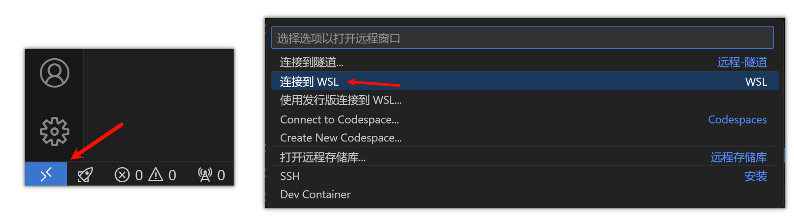

## 零、WSL2 简介

WSL2 是 Windows Subsystem for Linux 的第二代，是一个在 Windows 上运行 Linux 的子系统。WSL2 与 WSL1 最大的区别在于 WSL2 使用了真正的 Linux 内核，而 WSL1 则是通过 Windows 内核的适配层来运行 Linux。所以 WSL2 的性能更接近于真正的 Linux 系统。

## 一、安装 WSL2

### 1. 启用 WSL 功能

方法一：在 PowerShell 中执行以下两条命令，分别启用 WSL 和虚拟机功能：

```powershell
dism.exe /online /enable-feature /featurename:Microsoft-Windows-Subsystem-Linux /all /norestart
dism.exe /online /enable-feature /featurename:VirtualMachinePlatform /all /norestart
```

方法二：在“运行”中输入 `optionalfeatures` 打开“Windows 功能”，勾选“适用于 Linux 的 Windows 子系统”和“虚拟机平台”。

之后按照要求重启电脑。

### 2. 安装 WSL2

1. 下载并安装 [WSL2 Linux 内核更新包](https://wslstorestorage.blob.core.windows.net/wslblob/wsl_update_x64.msi)。这是为了将 WSL1 升级为 WSL2，否则在 WSL2 下安装 Linux 发行版时会出现错误。

2. 在 PowerShell 中执行以下命令，将 WSL2 设置为默认版本：

```powershell
wsl --set-default-version 2
```

### 3. 安装 Linux 发行版

在 PowerShell 中输入 `wsl -l -o` 查看可用的 Linux 发行版：

```powershell
$ wsl -l -o
以下是可安装的有效分发的列表。
请使用“wsl --install -d <分发>”安装。

NAME                            FRIENDLY NAME
Ubuntu                          Ubuntu
Debian                          Debian GNU/Linux
kali-linux                      Kali Linux Rolling
Ubuntu-18.04                    Ubuntu 18.04 LTS
Ubuntu-20.04                    Ubuntu 20.04 LTS
Ubuntu-22.04                    Ubuntu 22.04 LTS
Ubuntu-24.04                    Ubuntu 24.04 LTS
OracleLinux_7_9                 Oracle Linux 7.9
OracleLinux_8_7                 Oracle Linux 8.7
OracleLinux_9_1                 Oracle Linux 9.1
openSUSE-Leap-15.6              openSUSE Leap 15.6
SUSE-Linux-Enterprise-15-SP5    SUSE Linux Enterprise 15 SP5
SUSE-Linux-Enterprise-15-SP6    SUSE Linux Enterprise 15 SP6
openSUSE-Tumbleweed             openSUSE Tumbleweed
```

选择一个发行版，执行 `wsl --install -d <NAME>` 命令安装。例如，安装 Ubuntu 24.04：

```powershell
wsl --install -d Ubuntu-24.04
```

接下来在弹出的窗口中设置用户名和密码，安装完成后即可使用。

## 二、配置 WSL2

### 1. 更换国内镜像源

在 WSL2 中，可以更换软件源为国内镜像（如清华源），提高软件下载速度。

- 清华源：[Ubuntu 软件仓库](https://mirrors.tuna.tsinghua.edu.cn/help/ubuntu/)

> 在 Ubuntu 24.04 之前，Ubuntu 的软件源配置文件使用传统的 One-Line-Style，路径为 `/etc/apt/sources.list`；
> 
> 从 Ubuntu 24.04 开始，Ubuntu 的软件源配置文件变更为 DEB822 格式，路径为 `/etc/apt/sources.list.d/ubuntu.sources`。
{: .prompt-tip }

#### Ubuntu 24.04 及之前版本

如果你安装的是 Ubuntu 24.04 之前的版本，可以复制清华源的 One-Line-Style 配置到 `/etc/apt/sources.list`：

```bash
cd /etc/apt/
sudo cp sources.list sources.list.bak
vim sources.list
```

点击 `i` 进入输入模式，之后将清华源的 One-Line-Style 配置粘贴到 `sources.list` 文件中，点击 `<ESC>`，输入 `:wq` 保存退出。

或者直接在 Windows 系统的资源管理器中打开 `\\wsl$\<你的WSL系统名称，如Ubuntu-24.04>\etc\apt` 文件夹，编辑 `sources.list` 文件。

#### Ubuntu 24.04 及之后版本

如果你安装的是最新的 Ubuntu 24.04，可以复制清华源的 DEB822 格式配置到 `/etc/apt/sources.list.d/ubuntu.sources`：

```bash
cd /etc/apt/sources.list.d/
sudo cp ubuntu.sources ubuntu.sources.bak
vim ubuntu.sources
```

点击 `i` 进入输入模式，之后将清华源的 DEB822 格式配置粘贴到 `ubuntu.sources` 文件中，点击 `<ESC>`，输入 `:wq` 保存退出。

或者直接在 Windows 系统的资源管理器中打开 `\\wsl$\<你的WSL系统名称，如Ubuntu-24.04>\etc\apt\sources.list.d` 文件夹，编辑 `ubuntu.sources` 文件。

### 2. 安装 Anaconda

在 WSL2 中安装 Anaconda，可以方便地管理 Python 环境。

- 清华源：[Anaconda 安装包](https://mirrors.tuna.tsinghua.edu.cn/anaconda/archive/)
- 清华源：[Anaconda 软件仓库](https://mirrors.tuna.tsinghua.edu.cn/help/anaconda/)

#### 下载安装包

在清华源的 Anaconda 安装包页面中，选择 `Linux-x86_64` 体系下的最新版本下载，如 `Anaconda3-2024.06-1-Linux-x86_64.sh`（可以点击Date右侧的箭头按时间排序）。

在浏览器复制下载链接，使用 `wget` 命令下载：

```bash
cd ~
wget https://mirrors.tuna.tsinghua.edu.cn/anaconda/archive/Anaconda3-2024.06-1-Linux-x86_64.sh
```

运行安装脚本：

```bash
bash Anaconda3-2024.06-1-Linux-x86_64.sh
```

按照提示安装 Anaconda，安装完成后可以使用 `conda` 命令。

#### 配置 Anaconda 国内镜像源

在清华源的 Anaconda 软件仓库页面中，找到更换为清华源推荐的配置内容：

```yaml
channels:
  - defaults
show_channel_urls: true
default_channels:
  - https://mirrors.tuna.tsinghua.edu.cn/anaconda/pkgs/main
  - https://mirrors.tuna.tsinghua.edu.cn/anaconda/pkgs/r
  - https://mirrors.tuna.tsinghua.edu.cn/anaconda/pkgs/msys2
custom_channels:
  conda-forge: https://mirrors.tuna.tsinghua.edu.cn/anaconda/cloud
  pytorch: https://mirrors.tuna.tsinghua.edu.cn/anaconda/cloud
```

将上面的配置粘贴到 `~/.condarc` 文件中：

```bash
vim ~/.condarc
```

点击 `i` 进入输入模式，之后将清华源的配置粘贴到 `.condarc` 文件中，点击 `<ESC>`，输入 `:wq` 保存退出。

### 3. 创建 PyTorch 环境

在 WSL2 中使用 Anaconda 创建 PyTorch 环境。

先查看当前系统的 CUDA 版本：

```bash
$ nvidia-smi
Mon Sep 16 18:28:37 2024
+---------------------------------------------------------------------------------------+
| NVIDIA-SMI 545.46                 Driver Version: 546.80       CUDA Version: 12.3     |
|-----------------------------------------+----------------------+----------------------+
| GPU  Name                 Persistence-M | Bus-Id        Disp.A | Volatile Uncorr. ECC |
| Fan  Temp   Perf          Pwr:Usage/Cap |         Memory-Usage | GPU-Util  Compute M. |
|                                         |                      |               MIG M. |
|=========================================+======================+======================|
|   0  NVIDIA GeForce RTX 4060 ...    On  | 00000000:01:00.0 Off |                  N/A |
| N/A   37C    P8               1W / 140W |     76MiB /  8188MiB |      0%      Default |
|                                         |                      |                  N/A |
+-----------------------------------------+----------------------+----------------------+

+---------------------------------------------------------------------------------------+
| Processes:                                                                            |
|  GPU   GI   CI        PID   Type   Process name                            GPU Memory |
|        ID   ID                                                             Usage      |
|=======================================================================================|
|  No running processes found                                                           |
+---------------------------------------------------------------------------------------+
```

说明当前系统的 CUDA 版本为 12.3。接着在 PyTorch 官网查看最接近当前 CUDA 版本的安装命令。

- PyTorch 官网：[PyTorch 安装指南](https://pytorch.org/get-started/locally/)

```bash
conda create -n my_pytorch_env python=3.9
conda activate my_pytorch_env
conda install pytorch torchvision torchaudio pytorch-cuda=12.4 -c pytorch -c nvidia # 此处更换为你在 PyTorch 官网查到的安装命令
```

安装完成后，可以使用 `python` 命令进入 Python 环境，使用 `import torch` 检查 PyTorch 是否安装成功。使用 `torch.cuda.is_available()` 检查是否支持 GPU 加速。

```
>>> import torch
>>> torch.cuda.is_available()
True
```

## 三、配置 VSCode

点击左下角的远程连接图标，选择“连接到 WSL”，选择你的 WSL 系统，VSCode 将会自动连接到 WSL2 中的 Linux 系统。按照要求安装插件，即可在 VSCode 中编写 Python 代码。



## 四、配置 GitHub SSH Key

由于 GitHub 更新了安全策略，需要使用 SSH Key 连接 GitHub。我们需要在 WSL2 中生成 SSH Key 并手动添加到 GitHub，方可使用 Git 命令。

### 1. 生成 SSH Key 密钥对

在 WSL2 中执行以下命令生成 SSH Key 密钥对：

```bash
ssh-keygen -t rsa -C "<your_email_here@example.com>"
```

按照提示输入文件名和密码（均可留空，直接回车即可），生成 SSH Key。

### 2. 添加 SSH Key 私钥到 SSH Agent

```bash
eval "$(ssh-agent -s)"
ssh-add ~/.ssh/id_rsa
```

### 3. 添加 SSH Key 公钥到 GitHub

查看生成的 SSH RSA 公钥：

```bash
cat ~/.ssh/id_rsa.pub
```

RSA 公钥格式为：

```
ssh-rsa AAAAB3NzaC1yc2EAAAADAQABAAABgQDfZt... your_email_here@example.com
```

将输出的公钥添加到到 GitHub 的 SSH Key 设置中。

具体位置在：GitHub -> Settings -> [SSH and GPG keys](https://github.com/settings/keys) -> New SSH Key，将公钥粘贴到 Key 中，点击 Add Key 即可。

### 4. 测试 SSH Key 连接

测试 SSH Key 是否配置成功：

```bash
ssh -T git@github.com
```

如果出现 `Hi <your_username>! You've successfully authenticated, but GitHub does not provide shell access.` 说明配置成功。

## 参考链接

- [WSL2 官方文档](https://docs.microsoft.com/zh-cn/windows/wsl/)
- [清华大学开源软件镜像站](https://mirrors.tuna.tsinghua.edu.cn/)
- [PyTorch 安装指南](https://pytorch.org/get-started/locally/)
- [GitHub SSH Key 设置](https://docs.github.com/en/github/authenticating-to-github/connecting-to-github-with-ssh)
- [VSCode 连接 WSL2](https://code.visualstudio.com/docs/remote/wsl)
