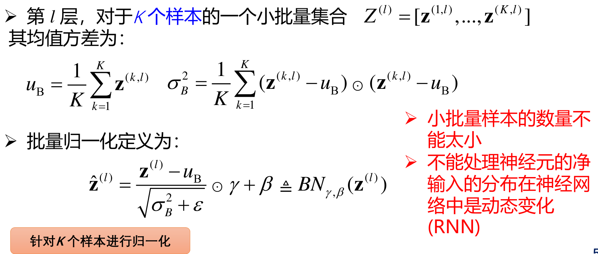

_这份笔记使用的部分图片、内容来自于北京交通大学深度学习课程，版权归课题组和原作者所有。_

## 背景：关心的问题

- **优化问题：**训练集上是否有好的结果？
- **泛化问题：**测试集上是否有好的结果？

### 优化问题

#### 难点

- 网络结构多样性

  - 神经网络种类繁多
  - 不同网络结构不同，不同参数的作用有差异
  - 很难找到一种通用的、高效的、稳定的优化方法
  - 超参数一般也比较多

- 非凸优化问题

  - 对普通低维空间
    - 如何初始化参数
    - 如何逃离局部最优
  - 深度神经网络的参数学习是非常高维空间的非凸优化问题
  - 在高维空间中，非凸优化最大的难点并不在于如何逃离局部最优点，而是如何逃离鞍点。

  

  - 在高维空间中，局部最小值（Local Minima）要求在每一维度上都是最低点，这种概率非常低。也就说是高维空间中大部分驻点都是鞍点。

#### 改善方法

网络优化的改善方法的目标是更高效地找到更好的局部最小值

- 网络结构多样性
  - 寻找高效、稳定的优化方法
    - 小批量梯度下降
    - 自适应学习率、梯度优化
    - 参数初始化、数据预处理
    - 逐层归一化
  - 超参数优化
- 非凸优化问题
  - 逃离局部最优
    - 自适应学习率、梯度优化

## 小批量梯度下降

- 批量梯度下降（batch gradient descent）：每次更新都使用整个训练集数据，需要较多计算资源。所以提出小批量梯度下降。

- 随机梯度下降（stochastic gradient descent）：每次只取一个样本（n）计算梯度

- 小批量梯度下降（minibatch gradient descent）：选取包含K个样本的小批量样本（minibatch）计算梯度

### **对比**

- **批量梯度下降**：利于寻找全局最优解，梯度方差小；但样本数目很多时，训练过程会很慢。
- **随机梯度下降**：训练速度快；准确度下降，不利于寻找全局最优，梯度方差大。
- **小批量梯度下降**：同时兼顾两种方法的优点。

### **批量大小的影响**

一般而言，批量大小不影响梯度的期望，但是会影响梯度的方差。

- 批量越大，梯度的方差越小，训练也越稳定，因此可以设置较大的学习率。
- 批量较小时，需要设置较小的学习率，否则模型会不收敛。

## 学习率与梯度优化

$$
\theta^t=\theta^{t-1}-\alpha \bold{g}^t
$$

### **学习率的影响**

- 学习率过大：不收敛
- 学习率过小：收敛太慢

#### 学习率衰减（Learning Rate Decay）

- 开始时，距离极值点处很远，采用大些的学习率，尽快接近极值点。
- 迭代多次后，接近极值点处，减小学习率，保证收敛，避免震荡。
- 多种减小学习率的方式

#### 学习率预热

为什么：当batch-size比较大时，需要比较大的学习率。但开始训练的参数是随机初始化的，梯度往往也比较大，加上比较大的初始学习率，会使得训练不稳定。

- 学习率预热 （Learning Rate Warmup）：为提高训练稳定性，可以在最初几轮迭代时采用较小的学习率，等梯度下降到一定程度后再恢复到初始学习率
- 逐渐预热（Gradual Warmup）：假设预热的迭代次数为 $$T'$$ ，预热过程中，学习率为：

- 当预热过程结束，再选择一种学习率衰减方法来逐渐降低学习率

#### 周期性学习率调整

为了逃离局部最小值或鞍点，可在训练过程中周期性地增大学习率。短期内有损收敛稳定性，长期来看有助于找到更好的局部最优解。

- 循环学习率：让学习率在一个区间内周期性地增大和缩小。
  - 三角循环学习率（Triangular Cyclic Learning Rate）：使用线性缩放来调整学习率
  - 带热重启的随机梯度下降（Stochastic Gradient Descent with Warm Restarts ）：
    周期性地重启并采用余弦衰减

#### 从学习率衰减到自适应学习率

学习率衰减的局限性

- **非自适应**，不能够根据当前梯度情况做出调整
- **每个参数的维度**上收敛速度都不相同，应该根据不同参数的收敛情况分别设置学习率。

从稀疏特征的角度来看：

- **某些特征出现的频率较低**，与其相关的参数更新的频率也比较低；
- 因此，常见特征的相关参数可以迅速地收敛到最佳值；
- 而不常见特征的相关参数，由于缺乏足够的观测样本，所以其最佳值难以确定；
- **学习率**要么对于常见特征的相关参数而言<u>衰减太慢</u>；要么对于不常见特征的相关参数而言<u>衰减太快</u>。

#### AdaGrad算法：Adaptive Gradient Algorithm

该算法借鉴了 L2 正则化的思想，每次迭代时，自适应地调整每个参数的学习率。

1. 在第 $$t$$ 次迭代时， 先计算每个参数梯度平方的累计值

2. AdaGrad 参数更新差值为

导致的结果是

- 如果某个参数的偏导数累计比较大（小）；其学习率相对较小（大）；
- 整体来看，随着迭代次数的增加，学习率逐渐缩小

#### RMSprop算法

**AdaGrad 局限**：在经过一定次数的迭代依然没有找到最优点时，由于这时的学习率已经非常小，很难再继续找到最优点

**RMSprop**：将 $$G_t$$ 的计算由“梯度的平方的累积”方式变成了“梯度平方的指数衰减移动平均”, 可以在有些情况下避免 AdaGrad 算法中学习率不断单调下降以至于过早衰减的缺点。

### 梯度修正

#### 动量法 （Momentum）

动量（Momentum）是模拟物理中的概念。一个物体的动量指的是该物体在它运动方向上保持运动的趋势，是是该物体的质量和速度的乘积。

动量法：用之前积累动量来替代真正的梯度。每次迭代的梯度可看作加速度。

一般而言，在迭代初期，梯度方向都比较一致，动量法会起到加速作用，可以更快地到达最优点。在迭代后期，梯度方向会不一致，在收敛值附近震荡，动量法会起到减速作用，增加稳定性。

#### Adam 算法

Adam算法：自适应学习率（RMSprop）+梯度方向优化（动量法）

#### 各优化算法比较

- RMSProp 和 Adam 更好
- 目前最流行并且使用很高的优化算法包括：
  - SGD
  - RMSProp
  - **Adam**

#### 梯度截断

除了梯度消失之外，梯度爆炸也是影响学习效率的主要因素。为了避免这种情况，当梯度的模大于一定阈值时，就对梯度进行截断，称为梯度截断（Gradient Clipping）

梯度截断是一种比较简单的启发式方法，把梯度的模限制在一个区间内。

- 按值截断

- 按模截断

## 参数初始化与数据预处理

梯度下降法需要在开始训练时给每一个参数赋一个初始值。

- 初始化为 0：对称权重现象

- 初始化范围太小：导致信号慢慢消失，还会使得 Sigmoid 型激活函数丢失非线性能力
- 初始化范围太大：导致信号变得过大，还会使得 Sigmoid 型激活函数变得饱和，从而导致梯度消失

### 初始化方法

- 预训练初始化：Pre-Training -> Fine-Tuning
- 固定值初始化：对于一些特殊的参数，我们可以根据经验用一个特殊的固定值来进行初始化，如偏置（bias）通常用0初始化
- 随机初始化方法
  - 基于固定方差的参数初始化
  - 基于方差缩放的参数初始化
  - 正交初始化方法

### 基于固定方差的参数初始化

目标：从一个固定均值（通常为 0）和方差 $$\sigma^2$$ 的分布中采样来生成参数的初始值

- 高斯分布初始化：从一个固定均值和方差的高斯分布 $$\mathcal N(0, \sigma^2)$$ 进行随机初始化
- 均匀分布初始化：在一个区间 $$[r,-r]$$ 内采用均匀分布来初始化参数。$$r = \sqrt{3\sigma^2}$$

一般而言，参数初始化的区间应该根据神经元的性质进行差异化的设置

- 如果一个神经元的输入连接很多，它的每个输入连接上的权重就应该小一些以避免神经元的**输出过大**（eg. ReLU）或**过饱和**（eg. Sigmoid）
- 初始化一个深度网络时，为了缓解梯度消失或者爆炸问题，须**尽可能保持每个神经元的输入和输出的期望始终为0，方差保持一致**
  - 根据神经元的连接数量自适应地调整初始化分布的方差
  - 方差缩放的目标
    - $$l-1$$ 层输出（即 $$l$$ 层输入）的均值 = $$l$$ 层输出的均值 = 0
    - $$l-1$$ 层输出（即 $$l$$ 层输入）的方差 = $$l$$ 层输出的方差

#### Xavier 初始化

#### He 初始化

何恺明团队提出

#### Xavier 初始化和 He 初始化的具体设置情况

#### 正交初始化

- 用均值为 0 、方差为 1 的高斯分布初始化一个矩阵；
- 将这个矩阵用奇异值分解得到两个正交矩阵，并使用其中之一作为权重矩阵。

### 基于方差缩放的参数初始化

### 数据预处理

数据尺度（Scale）不一样对优化的影响

#### 数据归一化

#### 白化

#### 实际建议

- 自然灰度图像：均值消减 → PCA/ZCA白化
- 彩色图像：简单缩放 → PCA/ZCA白化
- 音频 (MFCC/频谱图)：特征标准化 → PCA/ZCA 白化
- MNIST 手写数字：简单缩放/逐样本均值消减（→ PCA/ZCA 白化）

## 逐层归一化

### 批量归一化

批量归一化是对一个中间层的**单个神经元**的K个样本（mini batch）进行归一化操作。

### 层归一化

层归一化是对一个中间层的所有神经元进行归一化。

### 批量归一化和层归一化的比较

## 超参数优化

神经网络中的超参数：

- 层数、每层神经元个数、激活函数、学习率（各优化算法中包含的参数）、正则化系数、mini-batch 大小

优化难点

- 超参数优化是一个组合优化问题：无法像用GD来优化
- 评估一组超参数配置的时间代价非常高

优化方法：

- 网格搜索、随机搜索、贝叶斯优化、动态资源分配、神经架构搜索

### 网格搜索

**不可取**

网格搜索（Grid Search）是一种通过尝试所有超参数的组合来寻址合适一组超参数配置的方法。

假设总共有 $$K$$ 个超参数，第 $$k$$ 个超参数的可以取 $$m_k$$ 个值。比如学习率 $$\alpha$$，可以设置：α ∈ {0.01,0.1,0.5,1.0}.

这些超参数可以有 $$m_1 \times m_2 \times ... \times m_K$$ 个取值组合。

网格搜索根据这些超参数的不同组合分别训练一个模型，然后测试这些模型在验证集上的性能，选取一组性能最好的配置。

### 随机搜索

超参数对模型性能影响程度不一样。采用网格搜索会在不重要的超参数上进行不必要的尝试。一种改进方法是对超参数进行随机组合，然后选取一个性能最好的配置，这就是随机搜索。

**在性能较好的点的附近进一步尝试搜索。**

### 贝叶斯优化

### 动态资源分配

## 过拟合与正则化

如何提高神经网络的泛化能力：

- $$l_1$$ 和 $$l_2$$ 正则化
- 提前停止
- Dropout
- 数据增强

### l1 和 l2 正则化

### 提前停止

使用一个验证集来测试每一次迭代的参数在验证集上是否最优。如果在验证集上的错误率不再下降，就停止选代。

### Dropout

Dropout为什么会提升网络优化效果？

- Dropout简化了网络，防止过拟合
- Dropout可看作是一种集成学习：M个神经元 -> $$2^M$$个可能的网络

### 数据增强

图像数据的增强主要是通过算法对图像进行转变，引入噪声等方法来增加数据的多样性以及训练数据量。

图像数据的增强方法：

- 旋转（Rotation）：将图像按顺时针或逆时针方向随机旋转一定角度；
- 翻转（Flip）：将图像沿水平或垂直方法随机翻转一定角度；
- 缩放（Zoom In/Out）：将图像放大或缩小一定比例；
- 平移（Shift）：将图像沿水平或垂直方法平移一定步长；
- 加噪声（Noise）：加入随机噪声。